# 做市商的兩難：在成交機率與成交後報酬之間取捨

Jakob Albers¹、Mihai Cucuringu¹²³、Sam Howison⁴、Alexander Y. Shestopaloff⁵⁶

¹ 牛津大學統計系，英國牛津  
² 牛津大學 Oxford-Man Institute of Quantitative Finance，英國  
³ 加州大學洛杉磯分校數學系，美國洛杉磯  
⁴ 牛津大學數學研究所，英國牛津  
⁵ 倫敦瑪麗王后大學數學科學學院，英國倫敦  
⁶ 紐芬蘭紀念大學數學與統計系，加拿大 St. John's, NL

通訊作者：`jakob.albers@merton.ox.ac.uk`

2025 年 11 月 25 日

## 摘要

本文使用 Binance 比特幣永續合約上的實盤交易實驗資料，檢驗 (i) 基本訂單簿機制與 (ii) 價格變動從立即尺度到短時間尺度的持續性所造成的影響，揭示報酬、佇列大小與訂單佇列位置之間的互動。我們記錄到一項根本取捨：maker 訂單的成交可能性與成交後報酬呈負相關。這意味著可行的 maker 策略往往需要採取逆向方法，也就是反向交易當前的訂單簿不平衡。這些動態使得許多常被引用的策略高度不獲利，並促使我們建模「反轉」：在 touch 價位上，逆向 maker 策略證明有效的情境。

**關鍵字：** 做市、限價訂單簿、成交機率、最適執行、逆向選擇、高頻交易

**JEL 分類：** G13, G14, C81, C90

## 1. 導論

在限價訂單簿（limit order book, LOB）市場中，交易者對其訂單通常有三個立即目標：訂單有高機率成交；取得良好的成交價格（而不「掃穿訂單簿」）；以及取得良好的成交後報酬。這些目標通常彼此衝突，使「最適」交易成為困難任務。本文在高頻交易（HFT）的脈絡下探討此任務的若干面向。

在此，先心中保留兩種視角會很有幫助。其一是最適執行（Optimal Execution, OE）：交易者進行淨單向的一筆或一組交易，以買入或賣出某一部位；該部位可能相對龐大，也可能是代客交易。其二是「平衡庫存」（Balanced Inventory, BI）交易：透過大量交易賺取小額利潤，且交易者必須大致維持庫存平衡，最終平掉所有進入的部位。這些視角當然並不完整，也可能重疊（事實上，BI 交易可視為一連串小型 OE 交易）；各目標的重要性可能不同，且短時間尺度與較長時間尺度下的優先順序也可能不同。

LOB 中的市場參與者可以作為（流動性）taker、maker（流動性提供者），或兩者的組合來執行交易。Maker 訂單，亦即掛在最高買價或最低賣價、或更深層價位的被動限價單，提供較佳價格（至少省下 spread）且交易費顯著較低，有時甚至可獲得 rebate。學術文獻中，「限價單」常專指同側 maker 訂單（bid 側的被動 buy 訂單、ask 側的 sell 訂單）；但在實務中，限價單也可以掛在訂單簿「另一側」，成為可成交限價單。例如，buy limit order 若掛在最低賣價，會立即作為 taker 訂單（支付 taker fee）與從 top-of-book 到限價之間的被動訂單成交，剩餘部分才在限價形成一筆新的 maker 佇列。本文採用這個較精確的術語：一筆限價單可作為 maker、taker，或兩者的組合；並鼓勵學界也採用此術語。

這些優勢似乎表示 maker 訂單比 taker 訂單（市價單或可成交限價單）更具成本效益。然而，它們也有兩個顯著缺點。

首先，maker 訂單面臨**執行不確定性**：它們不會立即成交，也可能完全不成交，因此成交機率小於 1；市價單的成交機率則為 1。可成交限價單的成交機率略低於 1。

其次，maker 訂單的成交機率與其在成交條件下的後續報酬呈負相關。DeLise 等人稱此效果為 maker 訂單的**負漂移**，在本文聚焦的短時間尺度上尤其明顯。一項簡單的機械事實支撐了這個觀察：若下一次價格移動不利於位於 top-of-book 佇列中的 maker 訂單，該訂單會自動成交，成交機率為 1；這種現象常稱為**逆向選擇**。這類價格移動往往由短暫機會驅動，甚至可能等同於套利：價格以落後方式對外部訊號調整，使 maker 暴露於以過期報價交易的風險（Foucault 等人稱之為 toxic arbitrages）。相反地，若下一次價格變化與 maker 訂單方向相同，且在訂單成交前發生，則該訂單可能已不再位於訂單簿頂端，因而無法從有利價格變化中受益。

總而言之，maker 策略的根本挑戰，是同時取得高成交機率與成交後正報酬；兩者之間的取捨使得有利可圖的 maker 交易本質上困難。少有學術研究詳細檢驗這項取捨，或提出如何走過這條細繩的方法；下文將看到，這可能需要在表面上不利的條件下，借助額外訊號提交訂單，否則這些訂單本身會虧損。

相較之下，市價單以機率 1 成交（儘管大型訂單仍可能掃穿訂單簿，並如上造成立即價格變化）。此外，簡單策略如依照最高買賣佇列間訂單簿不平衡方向交易，已被證明能產生正的短期報酬。對流動性索取者而言，挑戰在於取得超過交易所 taker fee 的正報酬；taker fee 可視為獲利門檻。

本文使用全球最具流動性的加密市場 Binance USDT 保證金比特幣永續合約進行實驗，研究上述取捨。若 Binance 比特幣永續合約是一檔在 NASDAQ 交易的股票，以撰寫本文時（2024 年 8 月 9 日）的平均日交易量與市值來看，它的交易量會排名第一，市值排名第五。我們建構了一個資料集，包含一週期間內提交的 232,897 筆最小單位 maker 訂單，且不依賴任何交易訊號。若訂單未因 taker 訂單到達而成交，便留在佇列中；只有當價格變化使其掛在訂單簿更深層、不再位於 touch 時才取消。

此資料集讓我們能回答下列問題：

1. maker 訂單有多大機率成交？根據最小單位訂單資料，我們能對較大訂單的成交機率推論什麼？我們將其與最高買價與最高賣價既有掛單量的關係一起研究。
2. 在訂單提交後、仍在佇列中時，若這些數量發生變化，我們如何更新成交機率估計？這又如何幫助理解較大訂單的成交？
3. 產生正報酬的成交訂單與產生負報酬的成交訂單有何差異？
4. 訂單的佇列位置與成交後報酬之間有何關係？
5. 交易者能採用什麼策略，提交同時具有高成交機率與成交條件下正期望報酬的 maker 訂單？

我們研究掛在最佳價位（最高買價與最低賣價）的 maker 訂單之成交機率與價格漂移；這些價位對實務者極為重要，因為大多數 maker 與 taker 交易量都發生於此。我們也注意到，在 Binance 上，價差幾乎總是一個 tick，只有價格變動後短暫例外，而那時競爭會迅速把價差補回。

## 1.1 相關文獻與脈絡

乍看之下，我們提出的是相對具體的市場微結構問題。然而，由於這些問題具有通用性，它們位於並貢獻於遠比本文研究的比特幣市場更廣泛的脈絡。因此，我們先高層次概述相關主題與文獻，再於後續章節進行更細部分析。

### 1.1.1 Maker 訂單執行

maker 訂單成交機率的研究已在文獻中受到相當關注。應區分兩類問題：一是估計隨機掛單、且不依賴任何交易或取消訊號之訂單的成交機率；二是從歷史 LOB 資料推斷市場參與者實際掛出訂單的成交機率。前者是更根本的問題：如果我們掛出一筆訂單，也許條件化於訂單簿狀態或其他可觀察資訊，該訂單有多大機率成交？後者則是在檢驗市場參與者行為，決定他們選擇掛出的訂單之成交頻率。

兩者皆有價值，但後者的實務適用性受到系統性偏誤影響，本文稱之為**訊號偏誤**：估計出的成交機率隱含地條件化於交易者**未取消**該訂單，而交易者採用的取消政策對我們事前未知。這點重要性很難被高估，因為超過 95% 的 maker 訂單會被取消；交易者通常也遵循私人且事前未知的下單政策，例如只在他們認為逆向選擇不太可能時才下單。

兩篇近期研究採用後一種途徑，檢視市場參與者行為，但沒有明確凸顯上述重要區別。Fabre 等人認為，成交機率受到 bid-ask spread、訂單大小與流動性不平衡等市場條件顯著影響。Lokin 等人則將 LOB 動態建模為狀態相依的排隊系統，並於該框架中估計 maker 訂單成交機率，認為可以達到合理準確度。依據想回答的是上述哪一個問題，估計出的成交機率可能差異很大；例如，Lokin 等人在一 tick spread 且 bid/ask 佇列平衡時，對其他市場參與者掛單報告低於 2% 的成交機率，而我們在相同情境中找到約 50% 的成交機率。這主要是取消效果：真實 maker 會取消訂單，使歷史估計偏低；我們的不取消政策則給出不受私人訊號影響的基準。

處理更根本問題的文獻，其主要動機是 maker 與 taker 訂單之間的取捨：maker 訂單提供較好價格與費率，但不立即執行且可能完全不成交。Maglaras 等人在 NASDAQ 上模擬合成 top-of-book maker 訂單，紀錄其是否成交與成交時間，再建立深度學習模型預測成交機率與條件期望成交時間。Arroyo 等人的精神相近，但採用 CNN 與 transformer 對 maker 訂單進行存活分析，也納入掛在更深層訂單簿的訂單。然而，他們未依相對於不平衡的訂單簿側別區分掛單方向，這會在偏斜訂單簿中比較相同深度但相反側訂單的成交機率時造成不準確估計。

本文的貢獻如下。我們的資料集來自真實訂單及其結果，沒有訊號偏誤；也不像合成訂單方法那樣依賴事後推斷合成訂單何時可能成交。我們利用此資料分析 maker 訂單成交機率，並顯示它們可由簡單項目描述，且可由 top-of-book 數量與訂單佇列位置高度準確地預測。這質疑了使用缺乏可解釋性與可複製性的黑箱工具來解決此問題的必要性，因為它其實相當簡單。

### 1.1.2 取捨與交易決策

除了使用資料集估計成交機率，我們也用它說明：將這些知識或可預測性轉化為交易優勢有多困難。特別是，除價格與執行即時性之間的取捨外，我們強調成交機率本身與成交後報酬之間的取捨。這支持了前述主張：第一，maker 訂單很難同時具有高成交機率與正的後續報酬，因為成交時可能受到逆向選擇，而後續報酬良好時成交機率又低；第二，taker 訂單要取得超過 taker fee 的短期報酬也很困難。可將其視為一個卡通式的「不可獲利原理」：

$$
\text{Ease of prediction}\times \text{ease of exploitation} < c
$$

其中 $c$ 為某個正的常數。

maker 訂單的逆向選擇在早期文獻已被研究，Foucault 等人討論市場做市商需要監控資訊來源以取消過期報價，後續文獻則檢視做市商面對有資訊 HFT taker 反應新聞或套利者利用短暫價格調整時的逆向選擇風險。DeLise 等人近期透過分析 maker 訂單成交後價格軌跡，提供更細緻的逆向選擇研究。本文延伸這些工作，精確描述小時間尺度上成交機率與成交後報酬的關係，並展示此關係如何塑造做市商建構策略的方式。

為說明取捨的角色，假設交易者依據估計成交機率決定是否使用 maker 訂單，若其足夠高就下單。成交機率與後續報酬之間的取捨意味著，交易者可能無意間將訂單送至 bid/ask 中較短的佇列；如上所述，這可能使其遭受顯著且立即的不利價格移動。對 maker 與更一般的 BI 交易者而言，這顯然有害，因為成交後的不利價格移動在日後以更差價格平倉時會產生交易損失。OE 場景同樣有問題：雖然不必實現由不利價格移動造成的「損失」，但存在機會成本，因為原本可在稍後以更好價格進入部位。

### 1.1.3 使用訊號交易

我們已指出，某些基於基本公開資訊的自然策略，例如依不平衡方向提交 taker 訂單，或提交高成交機率的 maker 訂單，未必會帶來交易優勢。然而，若交易者有額外資訊，例如演算法產生的私人訊號，他們可能可採取更正面的看法。

假設最高買價佇列很大、最低賣價佇列很小，我們稱這是價格正向不平衡。在相對 tick size 較大或 maker rebate 顯著的市場（如本文市場）中，流動性通常集中在最高買賣價位，大部分交易量也在這些價位成交。直覺上，較短的 ask 佇列較可能先被清空，價差擴大後可能在 bid 側補上新佇列，導致價格上升。實務上，這點受到證實：不平衡與下一次價格移動方向呈正相關。

現在假設交易者以可信的私人訊號補強這個 modestly return-positive signal，暗示更強的短期報酬。應如何利用？若在大型 bid 佇列尾端提交 maker 訂單，成交機率很低，因而可能無法從預測中獲利；在較少數成交情況下，短期報酬也可能為負。或者，taker 訂單必定成交並受益於有利價格變化，但必須支付 taker fee。

現在假設佇列狀態如前（價格正向不平衡），但交易者高度信任的私人訊號預測價格下跌。逆著不平衡交易的 sell maker 訂單位於 ask 側，因佇列小而具有高成交機率；若私人訊號正確，則交易有利。sell taker 訂單則需支付更高費用並跨越價差。

這些論點說明，訂單型態與執行模式取決於交易者據以決策的訊號種類。許多文獻在「最適做市」名義下討論使用訊號交易，尤其涉及 maker 訂單時。部分研究假設 maker 訂單會在下一筆反方向 taker 訂單到達時成交，也就是 maker 訂單永遠位於佇列前端；但如上所論，這通常不能成立。另一些研究假設取消會均勻移除佇列流動性，這也有問題。

本文在此脈絡中的貢獻也回應導論最後一個問題：我們建立模型以辨識訂單簿不平衡錯誤預測下一次價格變化的情況。本文稱之為**反轉**，並在第 7 節進一步討論。這些情境一旦能準確預測，便容易轉化為交易優勢（透過逆不平衡方向放置 maker 訂單）；因此，依不可獲利原理，準確預測應該很難。確實，為了做出具有經濟意義的預測，我們必須仔細建構一組捕捉過去訂單流與價格變動相關微結構型態的特徵。

上述例子也說明佇列位置的影響：是在長佇列尾端提交，或在短佇列提交，會影響訂單成交機率與使用 maker 訂單執行交易訊號的有效性。沿不平衡方向提交 maker 訂單，通常意味著排在 bid/ask 中較長佇列的尾端，除非能在價格變化後第一時間補上 spread；這非常競爭，通常涉及延遲優化或特殊訂單型態。反之，逆不平衡方向提交 maker 訂單可取得較好的佇列位置，但需逆著期望報酬交易。文獻較少處理佇列位置；Moallemi 等人發現較差佇列位置與較低成交機率及較高逆向選擇相關，本文結果支持此點。Donnelly 等人也研究佇列位置、逆向選擇與取消行為之間的互動，並顯示在其模型中，最適策略有時會逆不平衡提交訂單，以受益於接近佇列前端的位置；這與本文發現一致。

## 1.2 記號與定義

本文分析設定於標準 LOB：它記錄等待執行或取消的 maker 訂單佇列，依價格與到達時間排序，並受最小訂單大小與 tick size 離散化。時間 $t$ 的訂單簿狀態由 bid 與 ask 兩側定義：

$$
\mathcal{B}_t := \left( p^b_{t, i}, Q^b_{t, i}, \left( q^b_{t, i, j} \right)_{j} \right)_{i=1,2,3,\cdots}, \qquad \mathcal{A}_t := \left( p^a_{t, i}, Q^a_{t, i}, \left( q^a_{t, i, j} \right)_{j} \right)_{i=1,2,3,\cdots}.
$$

其中 $p^b_{t,i}$ 與 $p^a_{t,i}$ 表示買賣價格，$Q^b_{t,i}$ 與 $Q^a_{t,i}$ 表示可用總量，$(q^b_{t,i,j})_j$ 與 $(q^a_{t,i,j})_j$ 表示該價位上依到達時間排序的個別訂單數量序列。我們使用 $B_t := Q^b_{t,1}$ 與 $A_t := Q^a_{t,1}$ 表示 top-of-book 數量。

進一步定義**訂單簿不平衡**：

$$
\operatorname{imb}_t := \frac{B_t-A_t}{B_t+A_t}\in(-1,1).
$$

當最高買價流動性遠大於最低賣價時，其值接近 $+1$；反之則接近 $-1$。如前所述，這些極端分別與價格上升與下降相關。

我們只關注掛在 top level 的 maker 訂單（以及成交它們的 taker 訂單），亦即掛在最低賣價 $p^a_{t,1}$ 的 sell 訂單與掛在最高買價 $p^b_{t,1}$ 的 buy 訂單。這兩個價位非常重要，因為整體交易量很大一部分都與 touch 上的訂單成交。為簡潔起見，本文中的 maker 訂單專指掛在兩個 top level 之一的 maker 訂單。掛在 LOB 更深層的 maker 訂單需要不同工具分析，超出本文範圍。

我們稱 maker 訂單所掛的佇列（bid 對 buy，ask 對 sell）為**近側**（near-side）佇列，另一側為**對側**（opposite-side）佇列。相應價格為 $p^{\text{near}}_{t,1}$ 與 $p^{\text{opp}}_{t,1}$，相應佇列大小為 $Q_t^{\text{near}}$ 與 $Q_t^{\text{opp}}$。後續討論訂單簿機制時，讀者可想像 buy maker 訂單提交至 bid（近側），ask 側為對側。

若訂單簿不平衡與訂單後續正報酬相關，我們稱其對訂單有利；門檻為 buy 訂單的 $\operatorname{imb}_t>0.5$，以及 sell 訂單的 $\operatorname{imb}_t<-0.5$。反之則稱為不利。

考慮時間 $t$ 掛在最高買價 $p^b_{t,1}$ 的 buy 訂單 $\mathfrak{o}$，其在個別訂單數量序列中的索引為 $j_0$。如圖 1 所示，定義該訂單前方流動性（liquidity ahead）為佇列中所有前序訂單總量：

$$
\operatorname{LA}_t(\mathfrak{o}) := \sum_{j<j_0} q^b_{t,1,j}.
$$

同理，後方流動性（liquidity behind）為後續訂單總量：

$$
\operatorname{LB}_t(\mathfrak{o}) := \sum_{j>j_0} q^b_{t,1,j}.
$$

最後，訂單在近側佇列中的**佇列位置**定義為：

$$
\operatorname{QP}_t(\mathfrak{o}) := \frac{\operatorname{LA}_t}{B_t-q^b_{t,1,j_0}}
=\frac{\operatorname{LA}_t}{\operatorname{LA}_t+\operatorname{LB}_t}, \quad \max(\operatorname{LA}_t,\operatorname{LB}_t)>0,
$$

若佇列中沒有其他訂單（$\operatorname{LA}_t=\operatorname{LB}_t=0$），則令其等於 0。佇列位置為 0 表示位於佇列最前；為 1 表示位於佇列最後。

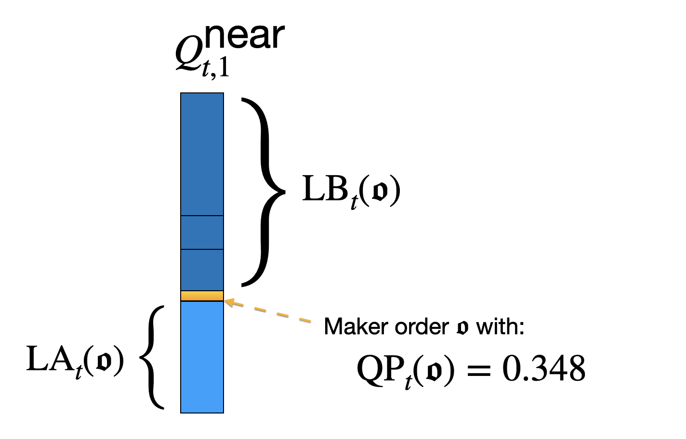

圖 1：前文引入之訂單屬性的視覺化示意。

$\operatorname{LA}_t(\mathfrak{o})$、$\operatorname{LB}_t(\mathfrak{o})$ 與 $\operatorname{QP}_t(\mathfrak{o})$ 是從訂單進入佇列到被成交或取消之間的時間序列。每次訂單簿更新都會為仍存在的訂單產生新值。此外，前方流動性 $\operatorname{LA}_t(\mathfrak{o})$ 隨時間下降，因為新訂單不能插入到任何既有訂單之前。

訂單 $\mathfrak{o}$ 有提交時間 $t_0(\mathfrak{o})$ 與終止時間 $T(\mathfrak{o})$，終止時訂單要麼成交，要麼取消；在我們的實驗設計中，訂單只有在其所掛價格不再是該側 top-of-book 時才取消。

我們使用時間 $t$ 的 microprice 描述 maker 與 taker 訂單的價格漂移；它是最高買賣價格的數量加權平均：

$$
p^\mu_t :=
\frac{B_t p^a_{t,1}+A_t p^b_{t,1}}{B_t+A_t}
=\frac{Q^{\text{near}}_t p^{\text{opp}}_{t,1}+Q^{\text{opp}}_t p^{\text{near}}_{t,1}}{Q^{\text{near}}_t+Q^{\text{opp}}_t}.
$$

midprice 則是最高買賣價格的簡單平均：

$$
p^\text{mid}_t := \frac{p^a_{t,1}+p^b_{t,1}}{2}
=\frac{p^{\text{near}}_{t,1}+p^{\text{opp}}_{t,1}}{2}.
$$

考慮一筆 maker 或 taker 訂單 $\mathfrak{o}$，於時間 $t_0$ 當 top-of-book 價格為 $p_{t_0}$ 時提交。依慣例，對 maker 訂單而言 $p_{t_0}$ 是近側 top price；對 taker 訂單而言，則是對側 top price。定義方向函數 $\operatorname{sgn}(\mathfrak{o})$，buy 為 $+1$，sell 為 $-1$，並將漂移值乘以該符號，以取得與方向無關的衡量；正值表示有利漂移，負值表示不利漂移。

若 $\mathfrak{o}$ 成交，以 $t_0+\tau_0$ 表示其成交時間。這指的是交易所撮合引擎處理後、而非處理前或處理中的時間：maker 訂單已從佇列移除，或 taker 訂單已移除其他流動性。對 taker 訂單而言，$\tau_0$ 通常非常小。訂單的立即**價格漂移**（bp）定義如下：若 midprice 未變，使用 signed microprice return；否則使用 midprice return：

$$
\operatorname{dr}(\mathfrak{o}) :=
\begin{cases}
\operatorname{sgn}(\mathfrak{o})\left(\frac{p^\mu_{t_0+\tau_0}}{p_{t_0}}-1\right)\cdot 10000, & \text{if }p^\text{mid}_{t_0}=p^\text{mid}_{t_0+\tau_0},\\
\operatorname{sgn}(\mathfrak{o})\left(\frac{p^\text{mid}_{t_0+\tau_0}}{p_{t_0}}-1\right)\cdot 10000, & \text{else}.
\end{cases}
$$

較長時間尺度的變體定義為：訂單在 $\tau>\tau_0$ 秒後的價格漂移為

$$
\operatorname{dr}_\tau(\mathfrak{o})
:=\operatorname{sgn}(\mathfrak{o})\left(\frac{p^\mu_{t_0+\tau}}{p_{t_0}}-1\right)\cdot 10000.
$$

**本文貢獻。** 我們呈現大規模實盤交易實驗，包含數十萬筆隨機放置的 maker 訂單，避免多數資料集中常見的訊號偏誤。我們分析訂單簿頂端成交機率，並顯示佇列大小與訂單位置如何影響 maker 訂單執行可能性。接著，我們展示成交機率與短期成交後報酬之間的取捨：大型佇列與佇列前端位置常產生最有利報酬，但成交率較低。我們也說明 taker 策略受到高昂費用限制，而成功 maker 交易需要利用訂單簿不平衡反轉、使表面上相反的基本訊號產生有利結果的情境。

## 2. 資料取得

我們的資料來自 Binance 線性比特幣永續合約市場上的實盤交易實驗；該市場是全球流動性最高的加密市場。

**實驗設計。** 我們進行兩個獨立實驗，各自採用不同報價模式：

1. **連續報價模式。** 我們在市場雙側持續報價：始終在最高買價維持一筆有效 buy 訂單，並在最低賣價維持一筆有效 sell 訂單。若最高買價上移或最低賣價下移而相應訂單未成交，我們取消並在更新後 top price 重新掛單。同樣地，若訂單成交，我們立即在相應側 top-of-book 價格掛出新訂單。實驗運行一週，從 2024 年 2 月 12 日至 19 日，共提交 232,897 筆最小單位 maker 訂單，其中 127,051 筆成交，105,846 筆未成交即取消。

2. **週期報價模式。** 每十秒，我們獨立地在最高買價提交 buy 訂單，並在最低賣價提交 sell 訂單，無視庫存、訂單歷史或有效訂單。若最高買價或最低賣價改變，使相應訂單掛在更深層訂單簿中，我們便取消該訂單。此實驗從 2024 年 8 月 21 日至 31 日運行，共提交 172,800 筆最小單位 maker 訂單，其中 95,998 筆成交，其餘未成交即取消。

兩種模式結果基本一致，本文呈現連續報價模式的發現。所得訂單資料集記為 $\mathcal{O}$，包含每筆訂單的限價、提交時間戳與終止狀態（成交或取消）。

**其他資料形式。** 本文的一項關鍵貢獻是實驗方法。我們選擇透過實盤交易實驗收集資料，以取得無訊號偏誤資料集，克服其他方法固有限制；其他方法大致有三類：

1. **合成訂單。** 在觀察到的市場資料中假想放置合成訂單，再根據後續真實市場事件追蹤其結果。此方法創造包含該訂單的假想 LOB 狀態，但忽略其潛在市場衝擊，若訂單較大尤其成問題。即使有完整 L3 資料，此方法也不能保證成交在真實世界可實現；使用 Binance L2 資料時，準確追蹤佇列位置及其結果更是不可能。

2. **被動使用既有訂單。** 觀察其他市場參與者已放置訂單；此方法受其他參與者訂單本身偏誤影響。此外，它不能確保被分析訂單來自同一交易者；在競爭激烈且參與者眾多的市場中，缺乏交易者識別使此點極不可能。

3. **模擬。** 範圍可從模擬整個 LOB 演化，到為決定訂單結果而進行有限短期前向模擬。由於資料保真度通常不足，這些方法完全不適合本文分析；此類模擬器常只是設計來複製一組 stylized facts。

圖 2 比較不同資料取得方法，評估六個面向：成交是否保證在真實世界可實現、是否納入延遲效果、資料是否允許分析單一交易者策略或訂單是否可能來自不同交易者、是否可分析最小單位以外的訂單大小、資料對真實交易的保真度，以及分析訂單中是否存在訊號偏誤。

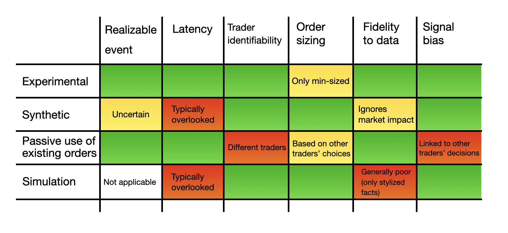

圖 2：不同資料形式的比較，評估面向包括成交是否可在真實世界中實現、是否納入延遲、是否可識別單一交易者、是否支援不同訂單大小、對真實交易的保真度，以及是否存在訊號偏誤。

**市場微結構與費用。** 與多數加密交易所相同，Binance 採用階梯式費率結構，交易量是主要但非唯一因素；在最有利等級下，taker fee 為 1.5 bp，maker fee 為 $-0.5$ bp（亦即 maker 訂單 rebate）。tick size 為 0.1 美元，在實驗期間約 0.03 bp，與費用相比可忽略。市場通常具穩健流動性，最高買賣價位上有數十萬美元可用，spread 幾乎總是一個 tick。後續分析假設最佳可能交易費；任何較差費率只會讓策略結果惡化。

## 3. Maker 訂單的兩個基本屬性

我們現在延伸前述觀察，檢視訂單（maker 或 taker）的**風險輪廓**。它有四個基本屬性：成交價格、交易費、成交機率與價格漂移。這四者是決定單筆訂單未實現 PnL，並延伸決定 BI 策略已實現 PnL 的最基礎因素。波動度、流動性水準或更廣資訊集合也會影響 PnL，但它們透過這四個基本屬性發揮作用。

需注意的是，雖然延遲是影響 maker 與 taker 訂單的關鍵交易面向，為避免冗長技術討論，本文將延遲視為可忽略。這簡化論述；整體而言，仔細處理延遲會強化我們的結論。

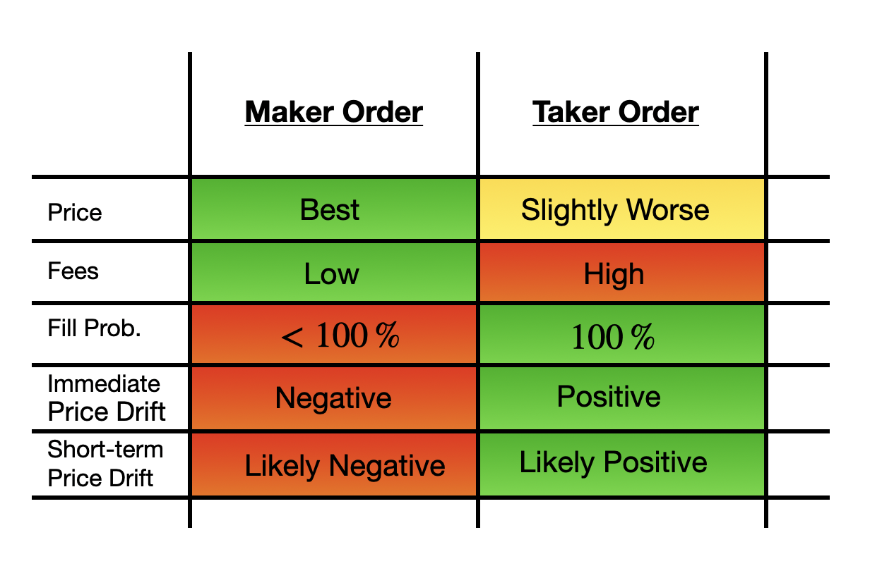

圖 3：maker 與 taker 訂單關鍵屬性的比較。

圖 3 比較掛在 touch 的 maker 訂單與市價單的上述四項屬性。兩者各有兩項有利屬性，也各有兩項挑戰。

為固定想法，考慮 buy 訂單（sell 訂單反向即可）。圖 3 前兩列顯示對 maker 有利、對 taker 不利的屬性。由於忽略延遲，maker buy 訂單的價格確定，提交時固定在最高買價；taker buy 訂單以事前不確定價格執行，至少與最低賣價一樣高，而最低賣價至少比最高買價差一個 tick。更重要的是，maker 訂單享有低交易所費用甚至 rebate，taker 訂單則承擔顯著更高的費用。

圖 3 其餘列列出對 taker 有利、對 maker 不利的屬性。對 maker 有利的成交價格與交易費在掛單時可觀察；不利的兩項，也就是成交機率與價格漂移，則未知且有效上隨機，可能高度變動，因此值得分析。本文稱它們為**maker 訂單的兩個基本屬性**。

taker 訂單總是立即成交；maker 訂單的成交機率小於 1，且若成交也是提交後某時點才成交。

立即價格漂移對 taker 有利。當 taker buy 訂單執行時，它移除最低賣價佇列中的流動性；若未吃完整個佇列，它會立即提高訂單簿不平衡與 microprice；若訂單大到清空整個佇列，則直接使 spread 向上擴大，midprice 上升。兩者都造成第一個成交後訂單簿快照中的有利立即變化，因此立即價格漂移為正。

maker 訂單情況相反。若掛在最高買價佇列的 maker buy 訂單成交，表示 sell taker 訂單移除了 bid 側流動性。若成交後佇列仍非空，microprice 下降且訂單簿不平衡更偏向價格負向；若 taker 訂單大到清空最高買價佇列，spread 向下擴大且 midprice 下降。

自然會問：這個初始移動是否在較長時間持續？midprice 變動可能由反向交易抵消，例如補回最初造成 spread 擴大的 taker 訂單所擊中的佇列。然而，文獻廣泛承認訂單簿不平衡與後續資產價格變動呈正相關，通常出現在毫秒至秒的短時間尺度。此外，若 taker 訂單造成立即 midprice 變動，高頻報酬的自相關暗示該趨勢短期可能持續。本文實證支持這些說法；第 7 節也探討相關性為何小於 1，也就是最初造成成交的移動偶爾會反轉。這類案例對做市極為重要。總之，maker 訂單經歷負的立即價格漂移，以及較長時間尺度下的負期望價格漂移，構成逆向選擇。

## 4. 成交機率

假設 $\mathfrak{o}$ 是時間 $t_0$ 提交至近側佇列的 maker 訂單，考慮其成交機率如何取決於近側的 $\operatorname{LA}_t(\mathfrak{o})$ 與對側佇列大小 $Q_t^{\text{opp}}$。我們提出兩個非正式論點，第一個關於 $\operatorname{LA}_t(\mathfrak{o})$，第二個關於 $Q_t^{\text{opp}}$，並用實證資料驗證其預測。

**1：近側流動性。** 訂單於 $T(\mathfrak{o})>t_0$ 成交，若且唯若該時刻有 sell taker 訂單在交易所撮合引擎中處理，且其數量超過該訂單前方流動性 $\operatorname{LA}_T(\mathfrak{o})$，吃掉 $\mathfrak{o}$ 以及佇列中更早的 maker 訂單。由於 taker 訂單大小小於給定數量的到達機率，會隨該數量降低而下降，因此在 $t_0<t\le T$ 期間，前方流動性越少，成交機率應越高。又因 $\operatorname{LA}_t(\mathfrak{o})\le \operatorname{LA}_{t_0}(\mathfrak{o})$，只要訂單仍在簿中，若有 taker 訂單於該價位到達且大小超過初始前方流動性，$\mathfrak{o}$ 必定成交。因此，掛在較小近側佇列中的訂單通常應較可能成交。

**2：對側流動性。** 對側佇列大小 $Q_t^{\text{opp}}$ 透過較間接機制影響 $\mathfrak{o}$ 的成交機率。當 $Q_t^{\text{opp}}$ 小時，在其他條件相同下，價格上升較可能發生，因為只需少量 taker 數量即可造成上升。相反地，當 $Q_t^{\text{opp}}$ 大時，價格上升較不可能，這會增加 $\mathfrak{o}$ 在 bid 佇列中的停留時間，因而增加大於 $\operatorname{LA}_t(\mathfrak{o})$ 的 taker 訂單到達時間。

總結而言，$(\operatorname{LA}_t(\mathfrak{o}), Q_t^{\text{opp}})$ 組合顯著影響 $\mathfrak{o}$ 的成交機率：較低的 $\operatorname{LA}_t(\mathfrak{o})$ 與較高的 $Q_t^{\text{opp}}$ 都提高成交機率。

**實證驗證。** 我們檢視成交頻率（也稱實證成交機率）如何依訂單提交時間 $t_0(\mathfrak{o})$ 的條件而變化。具體而言，分析條件化於提交時近側佇列大小 $Q^{\text{near}}_{t_0}$（等同初始前方流動性）與初始對側佇列大小 $Q^{\text{opp}}_{t_0}$ 的成交頻率：

$$
\operatorname{P}\left(\mathfrak{o}\text{ fills}\mid Q^{\text{near}}_{t_0(\mathfrak{o})}=Q^{\text{near}},\,
Q^{\text{opp}}_{t_0(\mathfrak{o})}=Q^{\text{opp}}\right).
$$

為取得實證估計，我們對 $Q^{\text{near}}$ 與 $Q^{\text{opp}}$ 採等寬分箱。具體地，將這些變數從樣本期間最小觀察值到第 99 百分位的範圍切成 20 個等寬 bins；使用第 99 百分位而非最大值，是為避免極偶發大訂單扭曲分析。超過第 99 百分位的佇列大小納入最大 bin。如此得到二維 bin 網格 $(Q_i^{\text{near}}, Q_j^{\text{opp}})$，其中 $i,j\in\{1,\cdots,20\}$。分箱時兼顧兩個目標：每個 bin pair 有足夠資料點以取得可靠估計，以及資料呈現具備足夠粒度。

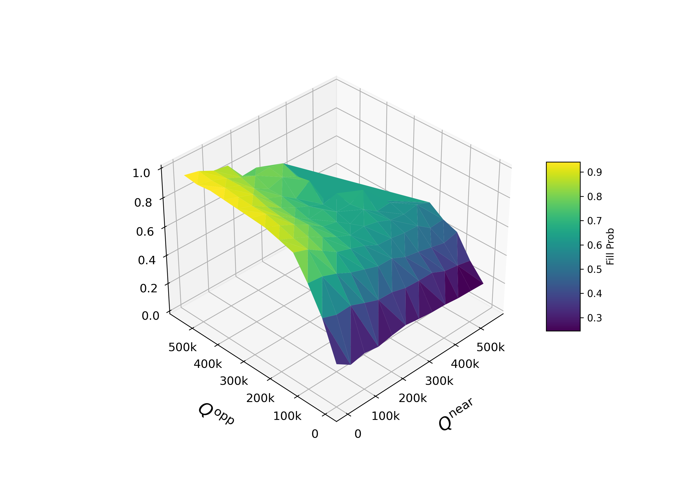

圖 4：成交機率作為近側與對側佇列大小（以美元計）的函數。

對每個 bin pair，我們將落入該 pair 且成交的訂單比例計為實證成交機率。記 $z=\operatorname{pr}(Q^{\text{near}},Q^{\text{opp}})$ 為對分箱頻率資料的平滑近似（本文使用 Delaunay triangulation 插值），如圖 4。圖顯示成交機率隨近側佇列大小下降，並隨對側佇列大小上升。當近側佇列大且對側佇列小時提交的訂單成交機率低，可低至 30%；相反地，當近側佇列極小且對側佇列極大時，成交機率超過 90%。

最高成交機率出現在對側佇列很大且近側佇列近乎空的情況，意味著不利的訂單簿不平衡；但圖也清楚顯示成交機率並非只是不平衡的函數，因為在 $Q^{\text{near}}/Q^{\text{opp}}$ 固定的線上，不平衡相同。

為進一步量化成交機率、佇列大小與不平衡之間的關係，我們對圖 4 曲面配適 OLS 迴歸。佇列大小變數以其第 99 百分位標準化，使係數尺度可比。模型為：

$$
z=\beta_0+\beta_1 Q^{\text{near}}+\beta_2 Q^{\text{opp}}+\beta_3\text{imb}+\epsilon,
$$

其中 $z$ 表示成交機率，$Q^{\text{near}}$ 與 $Q^{\text{opp}}$ 表示標準化佇列大小（符號略有濫用），$\text{imb}:=(Q^{\text{near}}-Q^{\text{opp}})/(Q^{\text{near}}+Q^{\text{opp}})$。模型 $R^2=0.946$，幾乎完美配適資料，顯示成交機率可用極低複雜度估計。

估計係數為 $\beta_0=0.5649$、$\beta_1=0.0159$、$\beta_2=0.1013$、$\beta_3=-0.3166$。p-values 顯示除 $Q^{\text{opp}}$（$p=0.065$）外，所有項皆統計顯著；主導因子為近側佇列大小（$p=0.000$）與不平衡（$p=0.000$）。

**中間時間。** 到目前為止，我們只根據提交時可得資訊估計成交機率。若在中間時間 $t>t_0(\mathfrak{o})$，已知 $\operatorname{LA}_t(\mathfrak{o})$ 與 $Q_t^{\text{opp}}$，能否更新估計？

一個忽略 $\operatorname{LB}_t(\mathfrak{o})$ 以及其他交易者對整個近側佇列大小反應的「零智能」方法，可能認為若 $(\operatorname{LA}_t(\mathfrak{o}),Q_t^{\text{opp}})$ 與另一筆訂單 $\mathfrak{o}'$ 在初始時間的 $(\operatorname{LA}_{t_0(\mathfrak{o}')}(\mathfrak{o}'),Q_{t_0(\mathfrak{o}')}^{\text{opp}})$ 相同，則兩者成交機率相同。理由是要終止訂單所需移除的總流動性，在近側（成交）或對側（取消）上都相同。

然而，$\operatorname{LB}_t(\mathfrak{o})$ 的累積可能降低近側 taker 訂單到達率、提高對側到達率、降低近側取消率（尤其是佇列前端訂單）、並提高對側訂單取消率，因為交易者會回應不斷演化的不平衡。這些反應都傾向降低 $\mathfrak{o}$ 相對於 $\mathfrak{o}'$ 的成交機率。因此，上述估計是中間時間成交機率的上界。真實成交機率與此上界之間的偏離，取決於非零 $\operatorname{LB}_t(\mathfrak{o})$ 對其他交易者決策的影響程度。

為取得更佳估計，可用 $\operatorname{LB}_t(\mathfrak{o})$ 做線性插值，例如 $\operatorname{QP}_t\operatorname{pr}(\operatorname{LB}_t,Q_t^{\text{opp}})+(1-\operatorname{QP}_t)\operatorname{pr}(\operatorname{LA}_t,Q_t^{\text{opp}})$。本文將此留待未來研究；我們的 L2 資料在每個價位聚合訂單，缺乏精確分析所需粒度。尤其 $\operatorname{LA}_t$ 與 $\operatorname{LB}_t$ 需要 L3 資料，而主要加密交易所多不提供。目前據我們所知，提供 L3 資料的交易所包括 Bitfinex、Coinbase、Bitstamp、Kraken 與 KuCoin。

**較大訂單。** 雖然出於成本限制，我們使用最小單位訂單，但可用資料找出較大訂單的完全或部分成交機率。任何大小 $q$ 訂單 $\mathfrak{o}$ 在給定 $(\operatorname{LA}_{t_0(\mathfrak{o})}(\mathfrak{o}),Q_{t_0(\mathfrak{o})}^{\text{opp}})$ 下完全成交的機率，等同另一筆最小單位訂單 $\mathfrak{o}'$ 在 $(\operatorname{LA}_{t_0(\mathfrak{o}')}(\mathfrak{o}')+q,Q_{t_0(\mathfrak{o}')}^{\text{opp}})$ 下成交的機率。部分成交亦可類似處理。

總結而言，成交機率可相對容易地由佇列大小預測。然而，易於預測並不代表易於獲利利用，因為成交機率與價格漂移之間存在取捨；下一節將更詳細探討。

## 5. 價格漂移

現在討論 maker 訂單的第二個基本面向：若成交，它們在短時間尺度上實現的後續報酬，也就是價格漂移。與前節相同，我們先提出兩個由基本訂單簿機制推導的非正式論點，再檢視實證資料。

**1：近側佇列。** 訂單的近側佇列大小 $Q^{\text{near}}_t$ 與佇列位置 $\operatorname{QP}_t(\mathfrak{o})$ 都會影響成交後價格漂移。若訂單在執行時間 $T(\mathfrak{o})$ 位於佇列最後，也就是 $\operatorname{LB}_T(\mathfrak{o})=0$（等價於 $\operatorname{QP}_T=1$），則造成成交的同一筆 taker 訂單也會使 midprice 朝不利於 $\mathfrak{o}$ 限價的方向移動，產生不利立即價格變動。反之，若 $\operatorname{LB}_T(\mathfrak{o})$ 很大，則成交本身直接造成不利 midprice 移動的可能性較低；除非 taker 訂單大到吃完整個近側佇列。我們因此預期 $\operatorname{LB}_T(\mathfrak{o})$ 越小，立即（且可能後續）逆向選擇幅度越大。重要例子包括在大型近側佇列中位於前端的訂單（$\operatorname{QP}_T\ll 1$），此時 $\operatorname{LB}_T$ 很大。

**2：對側佇列。** 再考慮成交時間的對側佇列大小 $Q_T^{\text{opp}}$。若 $Q_T^{\text{opp}}$ 很小，即使小交易也足以產生成交後有利於 $\mathfrak{o}$ 的價格變化。相反地，當 $Q_T^{\text{opp}}$ 增加，此有利價格移動越不可能。整體而言，我們預期逆向選擇程度（以條件期望 markout return 衡量）會隨對側佇列大小增加而惡化。

總結，我們應觀察到：

1. 逆向選擇程度隨 $\operatorname{LB}_T(\mathfrak{o})$ 增加而下降。$\operatorname{QP}_T\approx 1$ 的訂單無論佇列大小都可能產生負報酬；$\operatorname{QP}_T\approx 0$ 的訂單若近側佇列足夠大，可能產生正報酬。
2. 逆向選擇程度隨對側佇列大小 $Q_T^{\text{opp}}$ 增加而上升。

**實證驗證。** 我們檢視成交訂單的實證報酬分布，條件化於佇列位置以及近側、對側佇列大小。本文稱此報酬為訂單的 **markout return**，以成交訂單限價與成交一秒後 midprice 比較，單位為 bp；不含 maker rebate。$Q_T^{\text{opp}}$ 與 $Q_T^{\text{near}}$ 被分為大、中、小三個 bins，根據資料集中總佇列大小的分位數分析定義。

為計算所有成交訂單的精確成交時佇列位置 $\operatorname{QP}_T(\mathfrak{o})$，我們利用 Binance 公開 trades feed 的特殊性：對每筆 taker 訂單，交易所發布所有對應 maker fills，並依執行優先順序排序，每筆有唯一識別碼。maker 在提交訂單時收到同樣識別碼，因此可在收到成交後辨識自己位於一串 maker fills 中的位置。將更早 fills 的大小加總並與總佇列大小比較，即可計算精確 $\operatorname{QP}_T$；我們將此方法用於實驗中的最小單位 fills。

我們按百分位範圍定義 $\operatorname{QP}_T$ bins。例如 0%-10% 表示成交時位於佇列前 10%；75%-100% 表示位於佇列最後四分之一。接著檢視條件化於近側佇列大小 bin、對側佇列大小 bin 與佇列位置 bin 的 markout return 分布。

**近側佇列大、對側佇列小。** 此時訂單簿不平衡對訂單有利。我們考慮佇列位置兩端：第一十分位（0%-10%）與上四分位（75%-100%）；後者使用較大區間，因為較晚佇列位置的 fills 較少。

前端位置 fills 的 markout return 直方圖見圖 5，後端位置 fills 見圖 6。正報酬代表有利後續價格移動，負報酬代表不利移動。表 1 也提供這些直方圖與其他未顯示分布的摘要統計。

直方圖顯示結果有顯著差異。前端成交的分布質量主要在正值，並在小幅正 markout return 附近有明顯尖峰；平均值為 $-0.058$ bp。相反地，佇列後端 maker 訂單的成交多導致負結果，平均報酬為 $-0.775$ bp，且標準差更大。這顯示使用 maker 訂單沿訂單簿不平衡方向交易，只有在訂單從佇列前端成交時才值得。稍後我們會看到，沿不平衡方向使用 taker 訂單通常無法跑贏 taker fee，因此整體仍是虧損策略。

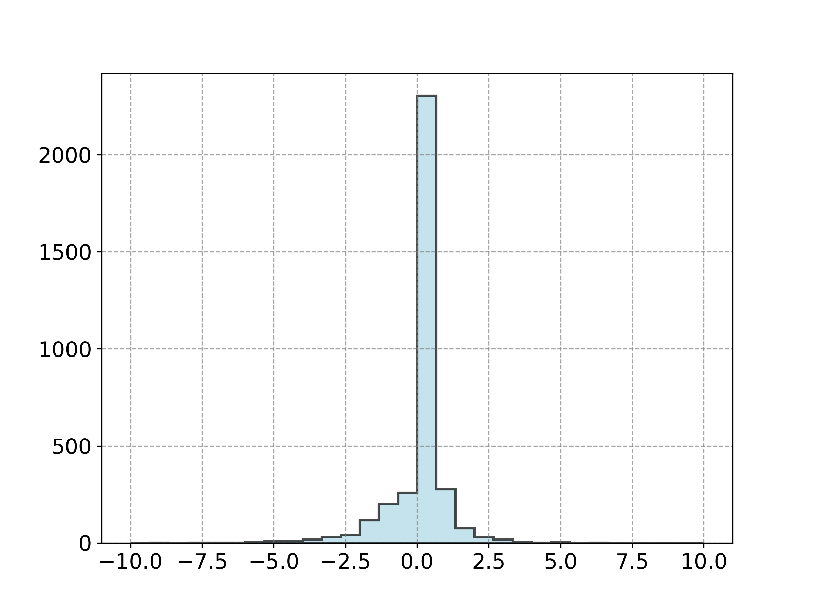

圖 5：佇列位置 0%-10%（前端）；近側佇列大；對側佇列小。

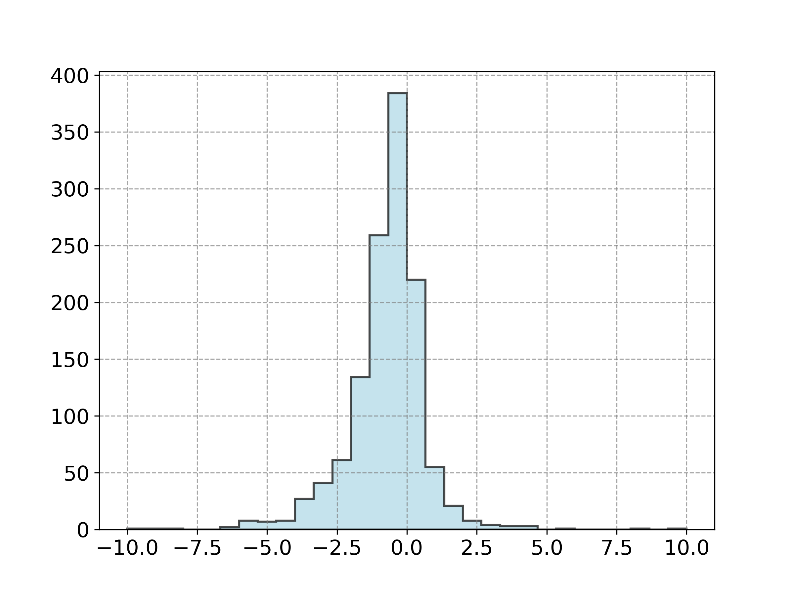

圖 6：佇列位置 75%-100%（後端）；近側佇列大；對側佇列小。

**兩側佇列皆大。** 圖 7 與圖 8 顯示近側與對側佇列都屬「大」bin 的情況，分別對應前端 0%-10% 與後端 75%-100% 位置。與前一組直方圖一致，前端訂單結果顯著較好。平均而言，結果略差於前述情境，符合此情境較不有利的訂單簿不平衡：前端成交平均 markout return 為 $-0.296$ bp，後端為 $-1.157$ bp。後端直方圖尤其顯示，絕大多數結果不利，幾乎所有 fills 都導致負 markout return。

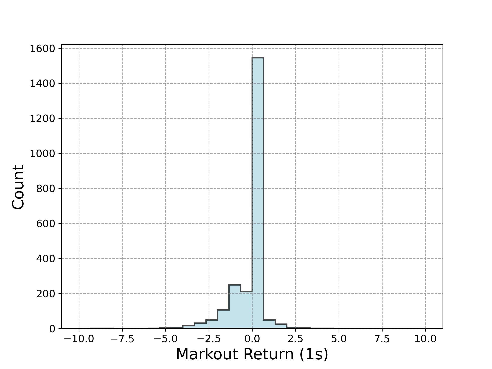

圖 7：佇列位置 0%-10%；近側佇列大；對側佇列大。

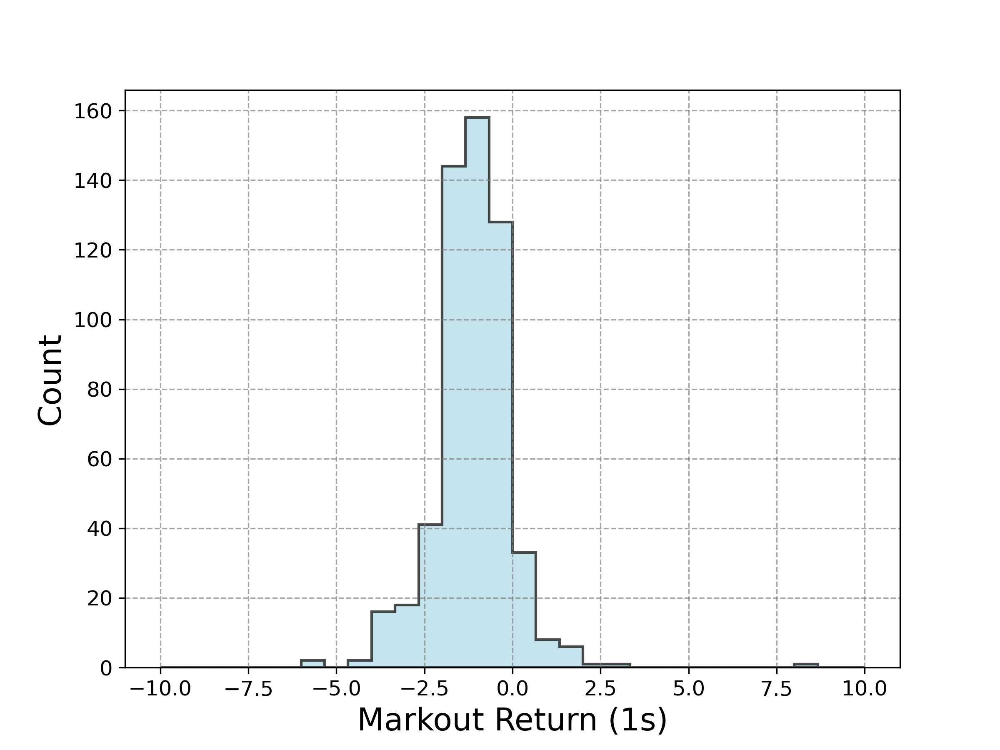

圖 8：佇列位置 75%-100%；近側佇列大；對側佇列大。

**近側佇列小、對側佇列大。** 主文最後一組直方圖顯示 $Q_T^{\text{near}}$ 小且 $Q_T^{\text{opp}}$ 大的訂單，代表訂單簿不平衡不利。圖 9 顯示前端位置結果，平均 markout return 為 $-0.539$ bp；圖 10 顯示後端位置結果，平均為 $-0.763$ bp。兩者大多為不利結果，markout return 主要為負。值得注意的是，兩個直方圖差異不大，表示當佇列小時，佇列位置影響不大；這符合前述討論，也具經濟直覺：若佇列很小，位於前端訂單後方的流動性與位於後端訂單相差不大。

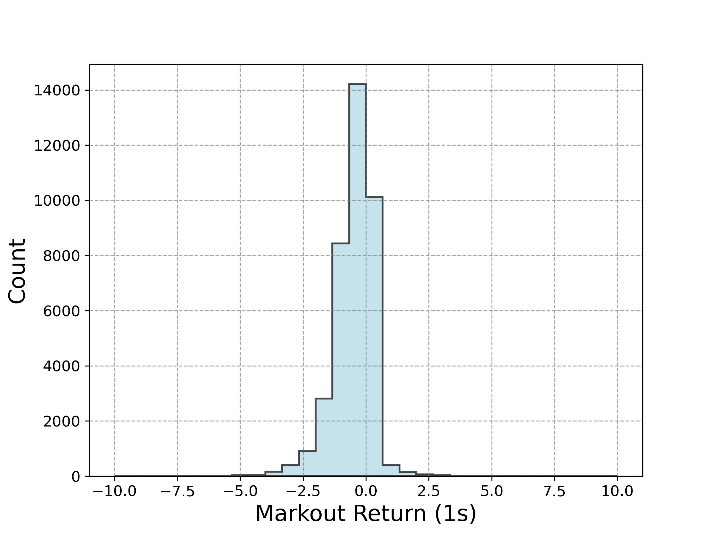

圖 9：佇列位置 0%-10%；近側佇列小；對側佇列大。

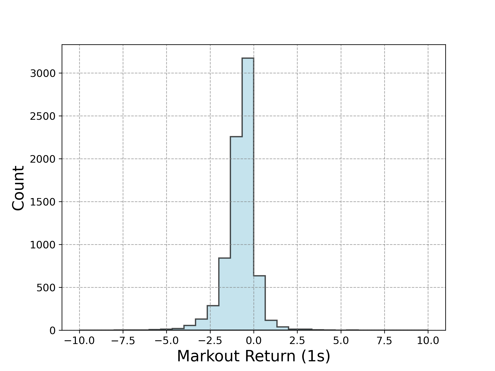

圖 10：佇列位置 75%-100%；近側佇列小；對側佇列大。

中型佇列的直方圖見附錄。本文省略中間佇列位置與部分中型佇列圖，因為小到中到大佇列大小、以及佇列前端到中段到後端位置的轉變是平滑的，未提供與上述不同的實質見解。

表 1：不同佇列大小與位置下的摘要統計。

| 佇列大小 | 佇列位置 | 平均 (bp) | 最小 (bp) | 最大 (bp) | 標準差 (bp) |
|---|---:|---:|---:|---:|---:|
| 近側大、對側小 | 0-0.1 | -0.058 | -9.2 | 6.3 | 1.0 |
| 近側大、對側小 | 0.1-0.4 | -0.586 | -9.5 | 7.0 | 1.3 |
| 近側大、對側小 | 0.4-0.75 | -0.743 | -8.6 | 6.0 | 1.3 |
| 近側大、對側小 | 0.75-1 | -0.775 | -27.3 | 9.5 | 1.6 |
| 近側大、對側大 | 0-0.1 | -0.296 | -8.9 | 4.1 | 0.9 |
| 近側大、對側大 | 0.1-0.4 | -0.882 | -6.1 | 3.0 | 1.1 |
| 近側大、對側大 | 0.4-0.75 | -0.967 | -7.2 | 3.9 | 1.1 |
| 近側大、對側大 | 0.75-1 | -1.157 | -5.8 | 8.0 | 1.1 |
| 近側小、對側小 | 0-0.1 | -0.562 | -16.7 | 18.8 | 1.6 |
| 近側小、對側小 | 0.1-0.4 | -0.711 | -13.8 | 8.8 | 1.8 |
| 近側小、對側小 | 0.4-0.75 | -0.622 | -14.0 | 17.3 | 1.9 |
| 近側小、對側小 | 0.75-1 | -0.677 | -19.8 | 20.2 | 2.2 |
| 近側小、對側大 | 0-0.1 | -0.539 | -19.0 | 21.0 | 0.8 |
| 近側小、對側大 | 0.1-0.4 | -0.645 | -33.4 | 5.2 | 0.9 |
| 近側小、對側大 | 0.4-0.75 | -0.686 | -9.8 | 9.7 | 0.8 |
| 近側小、對側大 | 0.75-1 | -0.763 | -14.6 | 10.7 | 0.9 |

## 6. 成交，然後被殺？

許多做市商在意識到自己收到成交時會立刻感到焦慮。這種心理壓力有充分理由：他們清楚知道，比起取得成交且不伴隨後續不利價格變化，取得成交且伴隨後續不利價格變化要容易得多。前面幾節已分別檢視 maker 訂單基本屬性；現在我們說明兩者之間的張力，以及它對 maker 訂單與做市策略的重大含義。

**maker 訂單成交機率與報酬的連結。** 我們在實驗中強調了 maker 訂單的兩個機械事實：(1) 若訂單終止時間（成交或取消）後的快照顯示 midprice 沒變或朝不利於訂單方向移動，該訂單必定成交；(2) 若快照顯示有利 midprice 移動，該訂單必定取消。也就是說，條件化於立即 midprice 變化時，若變化為正，maker 訂單成交機率為 0；若為零或負，成交機率為 1。我們現在考慮成交機率與較長 horizon 後續報酬之間的關係。

圖 11 顯示此關係。橫軸標示樣本中所有訂單（不論成交或因 top price 移開而取消）的紙上報酬，從訂單終止狀態（fill-or-cancel）起往後五秒衡量。縱軸顯示這些訂單中成交的比例，也就是給定後續報酬時成交機率的估計。圖揭示明顯反相關：後續五秒報酬為負的訂單很可能成交，而報酬為正的訂單成交機率低得多。雖然此結果本身不保證無條件期望報酬為負，因為負報酬訂單可能只佔整體小部分，且被大量小正報酬抵消，但實證資料確實顯示約 $-0.8$ bp 的負期望報酬，扣除 rebate 後約 $-0.3$ bp。

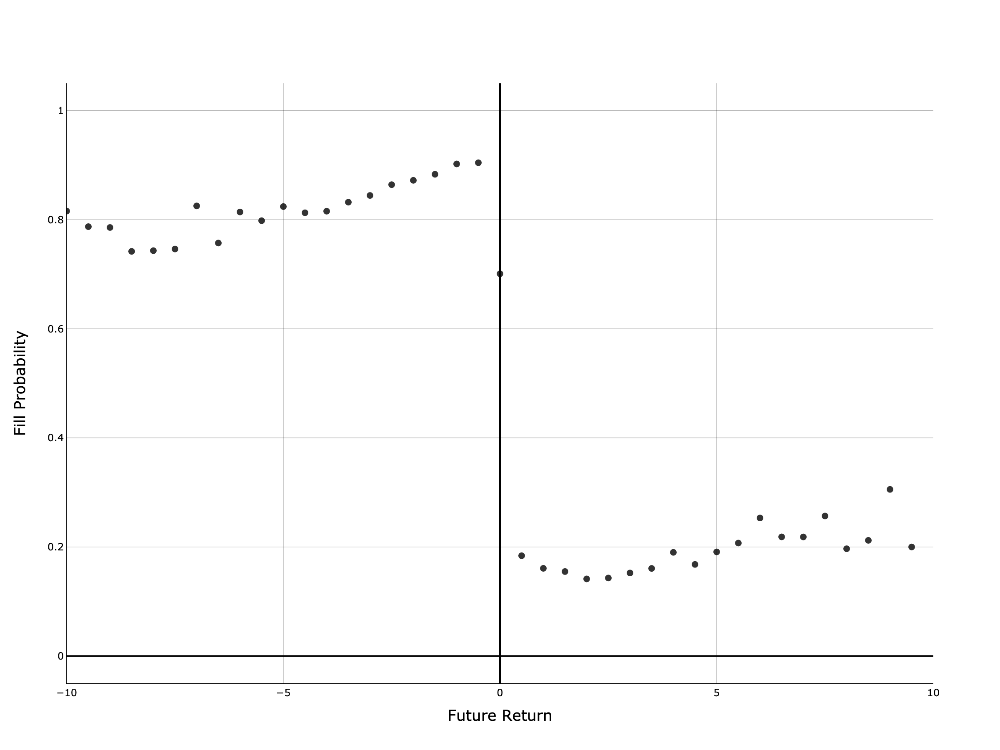

圖 11：成交機率與 post-time 後五秒報酬之間的實證關係。

這些觀察指出一個兩難：maker 訂單要麼可能成交但短期報酬為負（虧損），要麼不太可能成交但有正報酬（無法實現獲利）。這個兩難如何影響文獻中常被引用的基本做市策略之獲利性？

**做市策略的 PnL。** HFT 與做市文獻中常見的一個誤解，是認為做市商可以單純在最高買價與最低賣價掛單，以賺取 spread 加 rebate。許多論文常假設 maker 訂單以 Poisson rate 隨機成交，且不影響後續 midprice 演化，而 midprice 常被建模為連續擴散過程。

殘酷現實是，這類做市策略因負價格漂移而是通往破產的捷徑。本文以原型化 naive 做市策略為案例說明，並借鏡 DeLise 等人在美國國債市場對相同策略的分析；值得注意的是，完全不同資產類別也得到相同結果。

**基本 MM 策略**

1. 在最高買價掛一筆最小單位 buy 訂單，並在最低賣價掛一筆最小單位 sell 訂單。
2. 若部位不為零（因兩筆初始訂單之一成交），只在能使部位回到零的一側掛單。未成交訂單只要仍掛在 touch 就保留；若價格變動使該訂單不再掛在 top price，則取消並在新的 top price 掛新單。
3. 一旦收到使庫存回到零的成交，回到步驟 1。

人們可能想像，透過低買高賣（賺取 spread），策略可捕捉價差並在每對 post 中取得兩次 maker rebate。然而，這只有在兩筆訂單都成交且 midprice 未改變時才成立。上述策略之所以 naive，主要是因為缺乏精巧取消政策；訂單留在簿中，即使熟練交易者可能會取消以避免逆向選擇。現實中更常見的是，一筆訂單成交後，不利 midprice 變動迫使未成交訂單以更差價格取消並重掛。

在整體實驗中，我們在 bid 與 ask 雙側連續報價最小單位訂單且無庫存限制。基本做市策略提交的訂單是整體子集。我們抽取這些訂單並分析策略績效。最小單位訂單結果可指示較大訂單可能面臨的結果；合理預期較大訂單表現更差，因為市場衝擊文獻顯示 taker 訂單市場衝擊隨大小增加，而 taker 訂單對 maker 對手方造成的影響就是 maker 訂單遭受的逆向選擇。

圖 12 顯示該策略在約三天七小時期間的累積報酬（含 maker rebate，單位 bp）。期間結束時策略已虧損近 60%；年化 Sharpe ratio 高達 $-109.0$。開倉與平倉之間平均持有時間約 11 秒。

圖 13 顯示 round-trip 已實現 spread（開倉成交與後續再平衡成交間的 bp 價差）分布，頻率以對數尺度表示。雖然 round-trip 最常見結果確實是小幅正報酬，策略卻受到大量較大虧損與偶發災難性虧損拖累，壓過小額收益。

naive 做市策略因此是一張通往貧困的配方；對那些剛從學術界出來、被 maker rebate 誘惑而嘗試在實務中執行此策略的新手交易者而言，願天保佑。

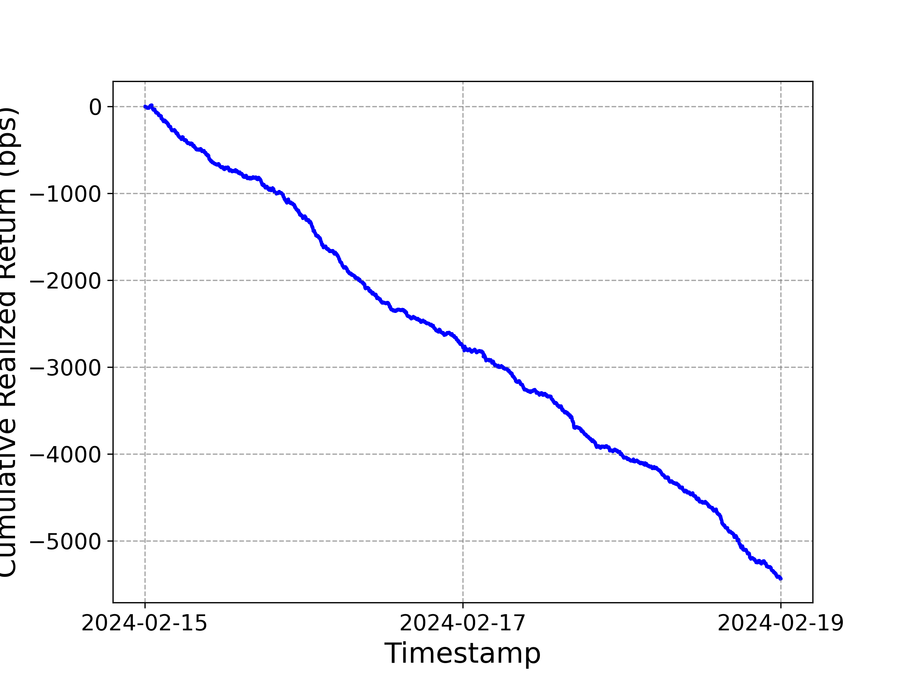

圖 12：基本做市策略的 PnL 圖（已扣除費用）。

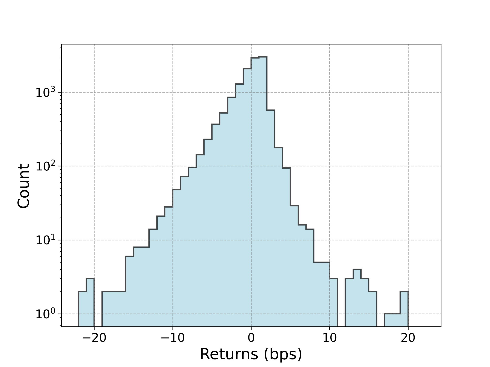

圖 13：基本做市策略 round-trip 交易在費前報酬的直方圖。

**依不平衡交易。** naive 策略表面上吸引人，因為可取得 rebate 並受益於 spread，但實際上高度不獲利。現在問：若將簡單訊號納入決策，更有選擇地依訊號掛單或在市場條件不利時取消，是否仍然如此？

微結構文獻中廣泛接受的一個典型交易訊號是訂單簿不平衡；本文已多次提及。我們研究文獻常見的一組基於不平衡的策略，雖然仍相對 naive，但表面上同樣有吸引力；結果顯示它也是虛假的希望。檢視策略包括：

- **基於不平衡的 maker 策略：** 沿不平衡方向掛 maker 訂單。與 naive 策略差異在於，只有當不平衡對 maker 訂單有利時才提交新訂單（提交門檻：絕對值 $>0.5$）。
- **含取消的基於不平衡 maker 策略：** 與上類似，但若不平衡轉為不利於訂單，則取消已掛訂單（提交門檻：絕對值 $>0.5$；取消門檻：0.0）。
- **基於不平衡的 taker 策略：** 使用 taker 訂單沿不平衡方向交易，採與 maker 策略相同的庫存平衡方式（提交 taker 訂單門檻：絕對值 $>0.5$）。此處忽略延遲，可能高估結果。

圖 14 顯示 maker 策略扣除費用後累積 PnL；圖 15 納入所有策略，包括 taker。對 taker 策略，我們提供扣除費用與費用前兩條曲線，以凸顯高頻交易中費用的巨大影響。表 2 摘要各策略主要統計，包括交易次數、費後報酬平均與標準差、以及平均持有時間。

結果鮮明：所有基於不平衡的策略，不論 maker 或 taker，都表現不佳，報酬全面為負。含取消的 maker 策略僅稍微減輕相對於無取消版本的損失。taker 策略交易最頻繁，儘管費用前高度獲利，扣費後表現最差。這些結果凸顯使用不平衡這類簡單公開訊號獲利的重大挑戰：

- taker 策略被 taker fee 變成不獲利：雖然費用前 PnL 亮眼（roundtrip 約 +1 bp），但每腿支付 taker fee 完全侵蝕獲利。
- maker 策略主要被成交機率破壞：它們幾乎總是錯過有利價格移動，留下較少數對應反轉的成交，也就是不平衡錯誤預測下一次價格變化的情況。取消規則只減輕其中一部分不利案例，亦即不平衡緩慢轉不利的情況，而非由大型 taker 訂單等造成的突然不利價格移動。

因此，我們認為即使訊號提供穩健費用前優勢，taker 策略仍難以克服 taker fee。maker 策略雖不支付 taker fee，但受佇列位置、成交機率與價格漂移交互作用影響，也不是簡單繞過問題的方法。因此，需要基於其他訊號的更精巧方法（雖不必然充分）。下文描述其中一種。

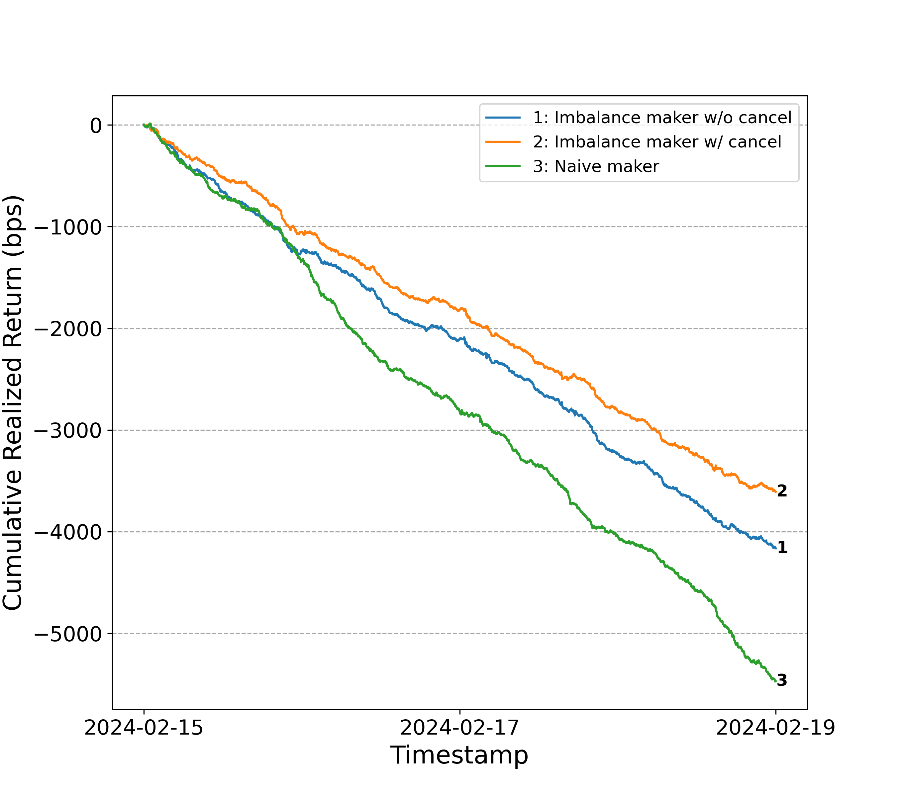

圖 14：各 maker 策略的 PnL 圖（已扣除費用）。

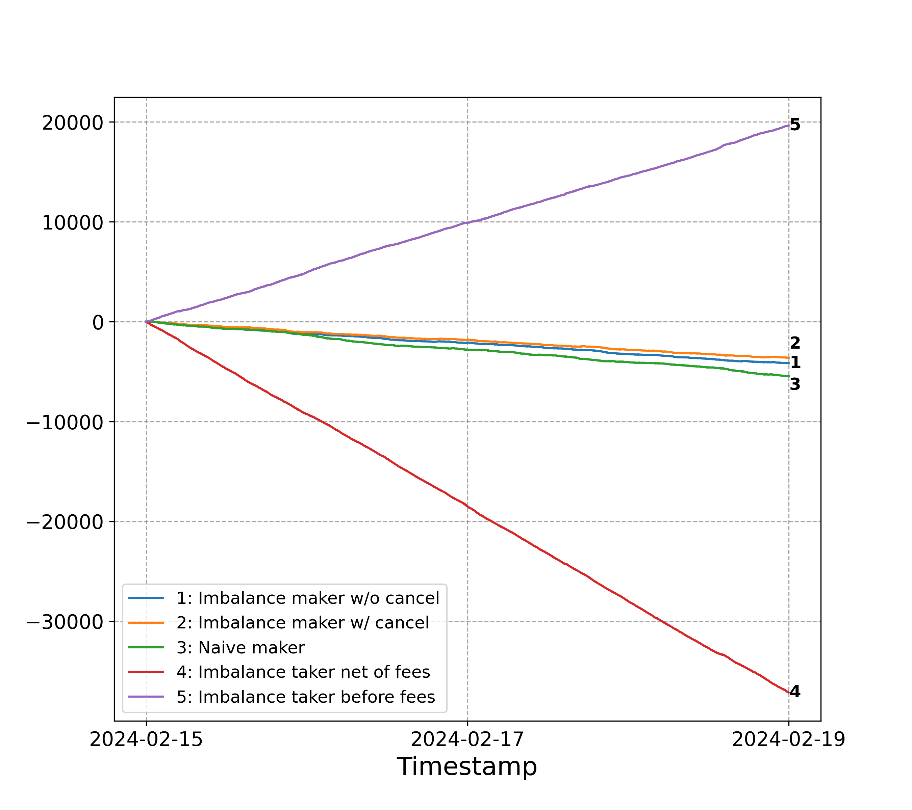

圖 15：maker 策略（已扣除費用）與 taker 策略（同時呈現扣費前後）的 PnL 圖。

表 2：交易策略統計（已扣除費用）。

| 策略 | 交易數 | 平均報酬 | 報酬標準差 | 平均持有時間（秒） |
|---|---:|---:|---:|---:|
| Imbalance taker | 18,927 | -1.9621 | 2.1653 | 15.04 |
| Naive maker | 12,623 | -0.4307 | 2.6486 | 22.56 |
| Imbalance maker w/o cancel | 8,851 | -0.4705 | 2.8529 | 32.17 |
| Imbalance maker w/ cancel | 7,333 | -0.4921 | 3.1143 | 38.83 |

**穿針引線。** 鑑於本節至此呈現的嚴峻證據，做市商如何在 (1) 為取得成交而必須吸收負的立即價格漂移，以及 (2) 在稍長 horizon（例如數秒）經歷正價格漂移之間穿針引線？也就是，如何被方向與 markout time 內後續訂單方向負相關的 taker 訂單成交？

第 5 節顯示，大多數 top-of-book 佇列大小與近側佇列位置組合主要導致負結果；例外是大型近側佇列中、位於前端的訂單（$\operatorname{QP}_T\approx0$），尤其當對側佇列小、亦即訂單簿不平衡有利時，報酬顯著為正。這暗示：沿不平衡方向、且位於佇列前端的 maker 訂單若成交，具有高成交機率且獲利；但當佇列位置往後移，成交變得較不可能且交易越發不獲利。問題因此變成：如何在大型近側佇列且不平衡有利時取得早期佇列位置？

答案不是在不平衡有利時排到大型佇列尾端，因為該訂單會處於大型佇列後端，期望報酬差。相反地，訂單需要在佇列仍小時掛出，並在之後不久變成大型佇列。這通常意味著在訂單簿不平衡不利時掛單，除非對側佇列也恰好很小；這又帶有事前較差的期望報酬。本文排除了價格剛變動後 spread 暫時大於一 tick、從而能在新 top-of-book 價位搶先掛單的情況；那主要是技術挑戰，涉及延遲優化與特殊訂單型態。

換言之，若要讓訂單能夠有利地與訂單簿不平衡一起交易，需要兩件事：先逆著不利不平衡交易，接著不平衡必須轉為有利。根據目前資訊，若沒有支持這一連串事件的額外訊號，這通常不是獲利方法。下一節討論如何建構這樣的訊號。

## 7. 反轉

第 4 節指出，當對側佇列大且近側佇列小（意味著不利不平衡）時提交的訂單具有高成交機率。雖然這些條件通常意味著較差期望報酬，如第 5 節所示，但有一部分案例中，初始不利不平衡在 post-time 後轉為有利，也就是初始不平衡錯誤預測下一次價格變化。本文稱這些情境為**反轉**；它們代表成交機率與成交後報酬之典型負相關可能失效的情境。辨識反轉雖不是完整交易策略，但提供了 maker 訂單基本挑戰的一種潛在解法。本文提出一個模型，不作為最終解答，而是用以說明相關機制，並展示這類機會原則上可被辨識。

圖 16 顯示將不平衡作為下一次價格變化預測器的混淆矩陣。離對角線的情況（反轉）中，逆不平衡交易的訂單具有高成交機率並產生有利後續報酬。右上格（左下格）代表可掛 sell（buy）訂單的機會，具有高成交機率與正價格漂移。

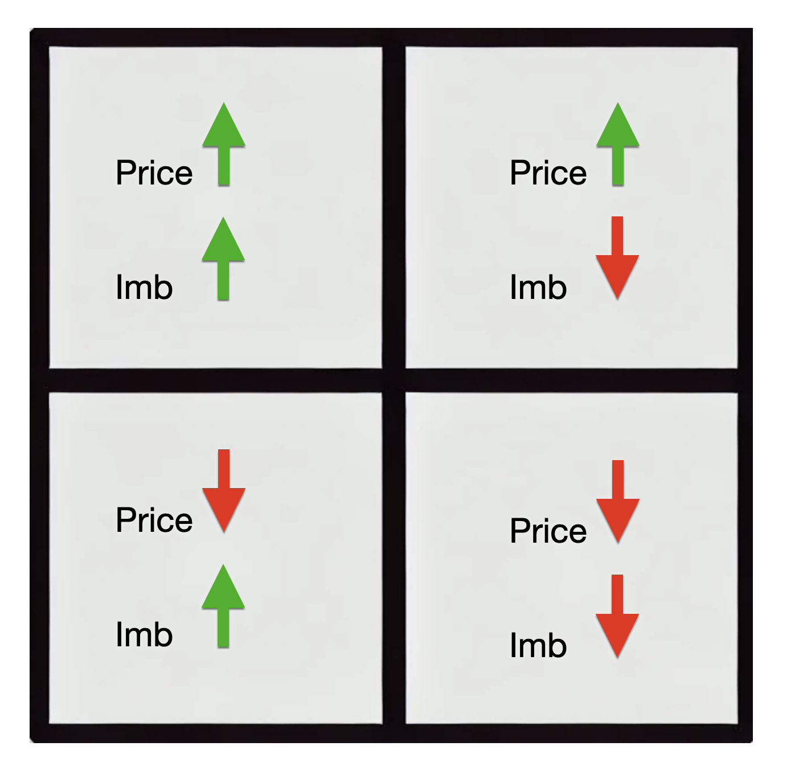

圖 16：混淆矩陣，以不平衡作為下一次價格變化的預測器；離對角元素代表反轉，右上格（左下格）對應可掛 sell（buy）訂單、同時具有高成交機率與正價格漂移的機會。

挑戰在於區分這些離對角線案例（反轉）與更常見的對角線案例（下一次價格變化與不平衡暗示方向一致）。本節其餘部分詳述我們預測反轉的建模策略、特徵集合與結果評估。

### 7.1 建模方法

首先，我們抽出估計成交機率高於選定門檻 80% 的訂單子集；結果在不同門檻下保持一致。估計是透過將初始 bid/ask 佇列大小映射到圖 4 的成交機率曲面取得。此訂單子集記為 $\mathfrak{O}$，包含一週期間的 182,381 筆訂單。我們使用資料集前半部訓練，後半部測試。此資料集中，平均對側佇列比近側佇列大 40%，代表這些訂單在初始不利不平衡下提交。

接著建立分類任務，目標是區分 $\mathfrak{O}$ 中經歷高成交機率（不利 bid-ask 偏斜）所暗示負價格漂移的訂單，以及成交後經歷正價格漂移的訂單。定義 binary label $\varphi:\mathfrak{O}\to\{0,1\}$，若 $\mathfrak{o}\in\mathfrak{O}$ 滿足：

1. 訂單 $\mathfrak{o}$ 成交，成交時間為 $T=T(\mathfrak{o})$。
2. 訂單取得正短期報酬：令 $T'\ge T$ 為成交後第一次價格變化時間戳，要求

$$
\operatorname{ret}_{T,T'}(\mathfrak{o})
:=\operatorname{sgn}(\mathfrak{o})\left(p(\mathfrak{o})/p_{T'}-1\right)\cdot 10,000>0.
$$

其中 $p(\mathfrak{o})$ 為訂單限價，$p_{T'}$ 對 buy 訂單為時間 $T'$ 的最高買價，對 sell 訂單為最低賣價；$\operatorname{sgn}(\mathfrak{o})$ 依方向給符號。未滿足條件者標為 0。此處 $\operatorname{ret}_{T,T'}(\mathfrak{o})$ 是成交時間與成交後下一次 midprice 變化之間、以 bp 表示的報酬。

為預測此輸出變數，我們使用 logistic regression，特徵為下節討論且在訂單提交時已知的一組變數。模型為：

$$
P(\varphi(\mathfrak{o})=1)=\frac{1}{1+\exp\left(\alpha_0+\sum_{i=1}^{n_f}\alpha_i x_i\right)},
$$

其中 $\mathbf{x}=(x_1,\cdots,x_{n_f})\in\mathbb{R}^{n_f}$。作為 benchmark，我們也使用 random forests；它們超越線性方法，但缺乏 logistic regression 的可解釋性。

### 7.2 特徵

本小節概述用於預測反轉的特徵。由於準確預測可輕易轉化為交易利潤，此任務預期本質上困難。雖然文獻未直接處理我們的具體問題，但可借鑑短期報酬預測等相關任務。例如，Ait-Sahalia 等人建構不重疊回看視窗以計算多種變數；Cohen 等人發展一組捕捉 LOB 當前狀態與近期活動的特徵，用以預測市場參與者交易決策。

我們的方法包含四組特徵：

1. **價格動態。** 包含兩個較長回看期的波動度衡量：`stdev_100`、`stdev_500`，為最近 100（500）個十秒報酬標準差，約涵蓋 16.66 分鐘與 83.33 分鐘。我們也分析多時間尺度價格移動：100 毫秒、1 秒、5 秒、30 秒與 5 分鐘，記為 `100ms`、`1s`、`5s`、`30s`、`300s`。每個尺度使用三個連續不重疊視窗（`w0`、`w1`、`w2`），計算：
   - `amplitude`：視窗內最高與最低價格差。
   - `ret_vwap`：視窗內 VWAP 相對當前 top-of-book 價格的 log return。

2. **交易量型態。** 在相同視窗內捕捉交易活動：
   - `max_size`、`avg_size`：最大與平均交易大小。
   - `buy_count`、`sell_count`：buy/sell 交易數。
   - `total_buy`、`total_sell`：buy/sell 總量。

3. **動能。** 反映價格趨勢與交易活動的持續性，在相同回看視窗計算：
   - `ret_autocov`：連續交易報酬自共變異數。
   - `ret_sum`：交易 log return 累積。
   - `trade_intensity`：連續交易間平均時間。

4. **LOB 狀態。** 評估 LOB 流動性輪廓：
   - `top_bid_liq`、`top_ask_liq`：最高買賣流動性。
   - `ob_bid_half`、`ob_ask_half`：bid/ask 側流動性衡量，定義為從 top bid/ask 到執行 50 萬美元所需 VWAP 的 bp 價差；越低代表 touch 附近流動性越高。
   - `totb_mean`：過去十分鐘 top-of-book 平均存活時間。
   - `age`：距上次 top-of-book 價格變化的秒數。

模型共使用 173 個特徵，全部在訂單提交時可觀察，因此預測在交易上可行：交易者能即時計算模型預測，決定是否掛單或等待更好時機。

此外，特徵經預處理，使模型不必區分 buy 或 sell 方向。具體而言，我們使用「同方向」與「反方向」取代 buy/sell，或使用「近側」與「對側」取代 bid/ask；對報酬等特徵，則根據訂單方向乘以符號。這讓模型在訓練與預測時等價處理買賣。

這些特徵之間雖存在相關性，例如波動度與交易量高度相關，但設計時刻意降低交叉相關。方法是在固定時間尺度使用連續不重疊回看視窗；不同時間尺度相差約一個數量級，使跨尺度視窗重疊很小。因此我們能直接以原始特徵訓練 logistic regression 與 random forest，無需額外預處理或降維，以免降低結果可解釋性。

### 7.3 結果

在交易領域，傳統分類模型評估指標（如預測準確率）常無法捕捉真正感興趣的指標：經濟顯著性或交易利潤。

例如，在我們的資料集中，只有約 15% 訂單是反轉。模型若永遠預測非反轉，可達表面上高達 85% 的準確率，但這樣的模型永不觸發交易，無法產生任何利潤或交易優勢。

進一步說明準確率與經濟顯著性的關聯很薄弱：若模型樣本外反轉預測大多是假陽性，模型仍可能有經濟價值，因為基於這些預測放置訂單的成交後報酬仍可能顯著優於隨機訂單。後續分析顯示我們模型即有此現象。

我們透過兩種典型交易策略評估模型預測的經濟顯著性：

1. **單向策略（Undirectional Strategy）。** 僅當模型預測反轉機率超過門檻 $p$ 時放置訂單。對不同 $p$，檢視這些訂單的成交機率與後續報酬。不施加庫存限制，允許任意方向庫存累積；負報酬解讀為機會成本。
2. **平衡庫存策略。** 類似第 6 節基本 MM 策略，但只有當模型（logistic regression 或 random forest）預測反轉機率超過 $p\in[0,1]$ 時才提交訂單。具體而言，若模型以機率 $>p$ 預測向下反轉，則在最高買價掛 buy 訂單；若預測向上反轉，則在最低賣價掛 sell 訂單。若庫存非零，策略只在能使部位回零的一側掛單，且需預測反轉機率 $>p$。因為此策略維持平衡庫存，可有意義地計算已實現 PnL。

**單向策略結果。** 表 3 比較 logistic regression 與 random forest 在不同門檻下的單向策略結果，列出測試期間每日下單數、實證成交機率、成交後 5 秒平均報酬及標準差。不同 return horizons 結果類似，但較長 horizon 因標準差增加而更雜訊。

兩種模型中，隨預測反轉機率門檻提高，下單數下降，符合預期。但反轉預測數量隨門檻提高而急遽下降，可能與訓練資料中反轉相對稀少的類別不平衡有關。成交機率在不同門檻間大致保持高水準。

最重要的是，成交後表現隨門檻提高顯著改善。這表示交易者若只在反轉預測機率相當高時下單，可捕捉經濟利益。對 logistic regression 而言，該經濟利益在反轉機率約 24%-26% 時變得顯著，成交後報酬顯著比隨機下單高約 0.1-0.2 bp。

表 3：不同門檻下單向策略的比較。

| Threshold | LR Orders/Day | LR Fill Prob | LR Return 5s | LR Stdev | LR p-value | RF Orders/Day | RF Fill Prob | RF Return 5s | RF Stdev | RF p-value |
|---:|---:|---:|---:|---:|---:|---:|---:|---:|---:|---:|
| 0.00 | 21689 | 0.8824 | -0.74 | 1.55 | 0.5000 | 21657 | 0.8824 | -0.74 | 1.55 | 0.5000 |
| 0.02 | 19438 | 0.8809 | -0.71 | 1.62 | 0.0003 | 21402 | 0.8825 | -0.71 | 1.56 | 0.0001 |
| 0.04 | 16596 | 0.8791 | -0.72 | 1.72 | 0.0165 | 20780 | 0.8813 | -0.67 | 1.57 | 0.0000 |
| 0.06 | 13939 | 0.8773 | -0.71 | 1.82 | 0.0018 | 19733 | 0.8807 | -0.67 | 1.58 | 0.0000 |
| 0.08 | 11674 | 0.8767 | -0.72 | 1.92 | 0.0397 | 18375 | 0.8794 | -0.68 | 1.61 | 0.0000 |
| 0.10 | 9566 | 0.8770 | -0.72 | 2.05 | 0.0607 | 16633 | 0.8785 | -0.68 | 1.66 | 0.0000 |
| 0.12 | 7723 | 0.8778 | -0.70 | 2.17 | 0.0040 | 14790 | 0.8773 | -0.69 | 1.71 | 0.0000 |
| 0.14 | 5979 | 0.8829 | -0.70 | 2.28 | 0.0189 | 12848 | 0.8761 | -0.71 | 1.77 | 0.0008 |
| 0.16 | 4441 | 0.8855 | -0.69 | 2.43 | 0.0083 | 11006 | 0.8743 | -0.71 | 1.83 | 0.0034 |
| 0.18 | 3158 | 0.8880 | -0.69 | 2.57 | 0.0334 | 9304 | 0.8732 | -0.69 | 1.90 | 0.0000 |
| 0.20 | 2104 | 0.8887 | -0.68 | 2.77 | 0.0496 | 7732 | 0.8690 | -0.70 | 1.96 | 0.0017 |
| 0.22 | 1365 | 0.8814 | -0.68 | 3.00 | 0.0903 | 6265 | 0.8687 | -0.69 | 2.04 | 0.0006 |
| 0.24 | 882 | 0.8673 | -0.62 | 3.24 | 0.0278 | 5034 | 0.8642 | -0.68 | 2.13 | 0.0003 |
| 0.26 | 577 | 0.8612 | -0.60 | 3.55 | 0.0432 | 3965 | 0.8589 | -0.68 | 2.18 | 0.0018 |
| 0.28 | 349 | 0.8559 | -0.45 | 3.86 | 0.0055 | 3037 | 0.8572 | -0.67 | 2.27 | 0.0010 |
| 0.30 | 233 | 0.8545 | -0.32 | 3.78 | 0.0011 | 2271 | 0.8523 | -0.63 | 2.41 | 0.0000 |
| 0.32 | 162 | 0.8284 | -0.40 | 3.78 | 0.0187 | 1675 | 0.8548 | -0.57 | 2.52 | 0.0000 |
| 0.34 | 113 | 0.8128 | -0.27 | 3.82 | 0.0093 | 1219 | 0.8527 | -0.50 | 2.59 | 0.0000 |
| 0.36 | 69 | 0.7913 | +0.27 | 3.49 | 0.0000 | 837 | 0.8507 | -0.41 | 2.61 | 0.0000 |
| 0.38 | 45 | 0.7733 | +1.34 | 3.57 | 0.0000 | 582 | 0.8521 | -0.32 | 2.80 | 0.0000 |
| 0.40 | 33 | 0.7818 | +2.11 | 3.75 | 0.0000 | 375 | 0.8465 | -0.33 | 2.99 | 0.0000 |
| 0.42 | 24 | 0.8250 | +2.65 | 3.69 | 0.0000 | 248 | 0.8537 | -0.30 | 3.12 | 0.0000 |
| 0.44 | 19 | 0.8125 | +2.66 | 3.72 | 0.0000 | 159 | 0.8441 | -0.13 | 3.54 | 0.0000 |
| 0.46 | 13 | 0.7826 | +3.45 | 3.88 | 0.0000 | 96 | 0.8113 | +0.05 | 2.88 | 0.0000 |
| 0.48 | 11 | 0.8421 | +3.49 | 4.23 | 0.0000 | 52 | 0.8161 | +0.76 | 3.02 | 0.0000 |
| 0.50 | 9 | 0.8750 | +3.02 | 1.92 | 0.0000 | 23 | 0.7692 | +1.68 | 3.35 | 0.0000 |

如何判定表 3 顯示的成交後報酬改善真的超過隨機下單，而非巧合？可透過 two-sample t-test，比較特定模型與門檻策略的平均報酬與隨機訂單平均報酬。例如，logistic regression 在 0.30 門檻下，平均成交後報酬為 $-0.32$，檢定「此策略與隨機訂單報酬無差異」的虛無假設；t-statistic 為 3.062602，p-value 為 0.0011，因此可在 5% 水準拒絕虛無假設，認為改善具統計顯著性。表中也列出所有反轉機率門檻的 p-values。

**平衡庫存策略結果。** 表 4 呈現基於模型與指定反轉機率門檻的平衡庫存策略績效。門檻 0 時，策略無限制，等同第 6 節 naive market-making 策略。隨門檻提高，策略只在模型預測反轉機率達一定程度的情境中提交訂單，因此掛單數下降。

報酬以已實現 roundtrip return 計算，定義為兩筆訂單限價間的 bp 價差：第一筆訂單累積庫存（從 0 變成 $\pm1$），第二筆使庫存回到 0。報酬經符號處理，使正報酬表示獲利，負報酬表示虧損。每腿 roundtrip 都取得 0.5 bp maker rebate，因此每次 roundtrip 加 1 bp。我們也呈現這些報酬的標準差、平均持有時間與策略年化 Sharpe ratio。Sharpe ratio 以小時期間計算，因為測試期間約 3.5 個交易日。

隨反轉機率門檻提高，fills 數顯著下降，代表 roundtrip 中連續交易間隔更長，也就是持有時間增加。高門檻下詮釋較困難，因此只顯示持有時間低於 10 分鐘（600 秒）的結果。

相較於 naive 策略，已實現 roundtrip PnL 的改善很明顯。naive 策略每 roundtrip 平均虧損 0.44 bp（扣除 rebate 後），且高頻發生，導致 Sharpe ratio 很差。較高門檻如 logistic regression 的 0.24 時，每日 roundtrip 數仍相對多（327/day，表中 fills/day 為 654），平均報酬 0.71，較 naive 策略顯著改善。類似假設檢定確認此差異統計顯著，不太可能由偶然造成。圖 17 與圖 18 分別顯示此門檻下累積 PnL 與 return histogram，作為圖 12 與圖 13 中 naive MM 策略結果的對照。

Sharpe ratio 從 naive 策略的 $-109$ 改善到 logistic regression 0.24 門檻下的 11.97，明確顯示模型提供重大經濟利益。需注意，這種亮眼 Sharpe ratio 不太可能在大於最小單位訂單時持續，且計算假設最佳 maker rebate（0.5 bp）。即使假設稍微變動，Sharpe ratio 可能大幅下降，但仍遠優於 naive 策略。

表 4：不同門檻下平衡庫存策略的比較。

| Threshold | LR Fills/Day | LR Avg Ret | LR Stdev | LR Holding | LR Sharpe | LR p-value | RF Fills/Day | RF Avg Ret | RF Stdev | RF Holding | RF Sharpe | RF p-value |
|---:|---:|---:|---:|---:|---:|---:|---:|---:|---:|---:|---:|---:|
| 0.00 | 15380 | -0.44 | 2.73 | 11.39 | -109.00 | 0.5000 | 15380 | -0.44 | 2.73 | 11.39 | -109.00 | 0.5000 |
| 0.02 | 14266 | -0.45 | 2.81 | 12.28 | -99.98 | 0.6369 | 15066 | -0.43 | 2.68 | 12.54 | -106.78 | 0.3933 |
| 0.04 | 12650 | -0.46 | 2.97 | 13.85 | -92.82 | 0.8177 | 14626 | -0.43 | 2.71 | 12.92 | -105.31 | 0.4158 |
| 0.06 | 10972 | -0.45 | 3.20 | 15.97 | -74.99 | 0.6278 | 13868 | -0.44 | 2.77 | 13.62 | -99.97 | 0.5441 |
| 0.08 | 9364 | -0.44 | 3.46 | 18.71 | -67.29 | 0.5270 | 12856 | -0.45 | 2.87 | 14.69 | -98.61 | 0.6727 |
| 0.10 | 7780 | -0.44 | 3.77 | 22.52 | -56.42 | 0.5230 | 11700 | -0.44 | 2.97 | 16.14 | -96.94 | 0.5340 |
| 0.12 | 6332 | -0.44 | 4.24 | 27.67 | -45.39 | 0.5187 | 10354 | -0.44 | 3.17 | 18.24 | -91.83 | 0.5305 |
| 0.14 | 4956 | -0.43 | 4.72 | 35.35 | -37.41 | 0.4469 | 8918 | -0.45 | 3.42 | 21.18 | -75.09 | 0.5897 |
| 0.16 | 3598 | -0.43 | 5.74 | 48.68 | -29.20 | 0.4867 | 7630 | -0.41 | 3.68 | 24.75 | -63.28 | 0.2555 |
| 0.18 | 2494 | -0.40 | 6.72 | 70.24 | -23.20 | 0.3908 | 6374 | -0.41 | 4.07 | 29.63 | -55.68 | 0.3011 |
| 0.20 | 1644 | -0.39 | 8.10 | 106.53 | -21.26 | 0.3975 | 5224 | -0.36 | 4.54 | 36.15 | -42.96 | 0.1011 |
| 0.22 | 1060 | -0.22 | 10.63 | 165.32 | -15.88 | 0.2504 | 4146 | -0.39 | 5.17 | 45.54 | -42.23 | 0.2794 |
| 0.24 | 654 | +0.71 | 13.69 | 267.66 | +11.97 | 0.0160 | 3222 | -0.39 | 5.90 | 58.61 | -34.28 | 0.3252 |
| 0.26 | 426 | +1.21 | 18.10 | 409.26 | +26.12 | 0.0303 | 2460 | -0.32 | 6.80 | 76.73 | -24.85 | 0.1948 |
| 0.28 | 270 | +0.90 | 22.52 | 595.97 | +12.32 | 0.1650 | 1826 | -0.21 | 7.82 | 103.27 | -18.78 | 0.1076 |
| 0.30 | - | - | - | - | - | - | 1330 | +0.03 | 8.90 | 141.75 | +1.30 | 0.0287 |
| 0.32 | - | - | - | - | - | - | 972 | +0.31 | 9.65 | 194.22 | +12.08 | 0.0078 |
| 0.34 | - | - | - | - | - | - | 692 | +0.59 | 12.20 | 272.14 | +13.48 | 0.0133 |
| 0.36 | - | - | - | - | - | - | 454 | +0.02 | 14.45 | 414.03 | +0.30 | 0.2501 |

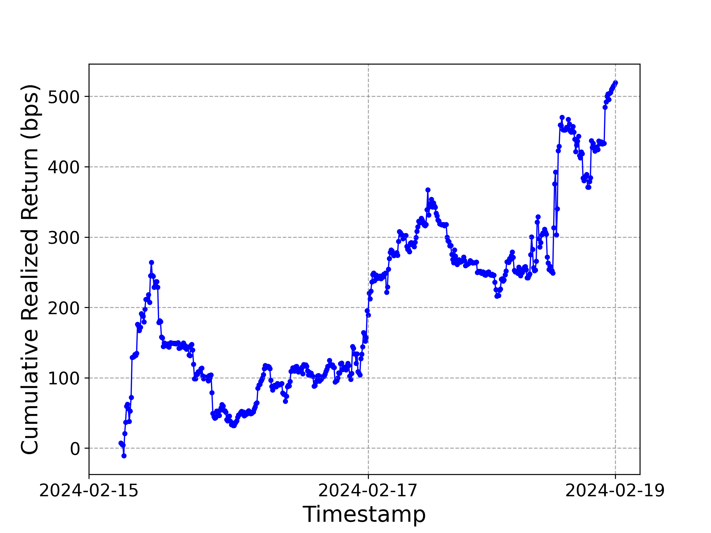

圖 17：模型式做市策略的 PnL 圖（已扣除費用）。

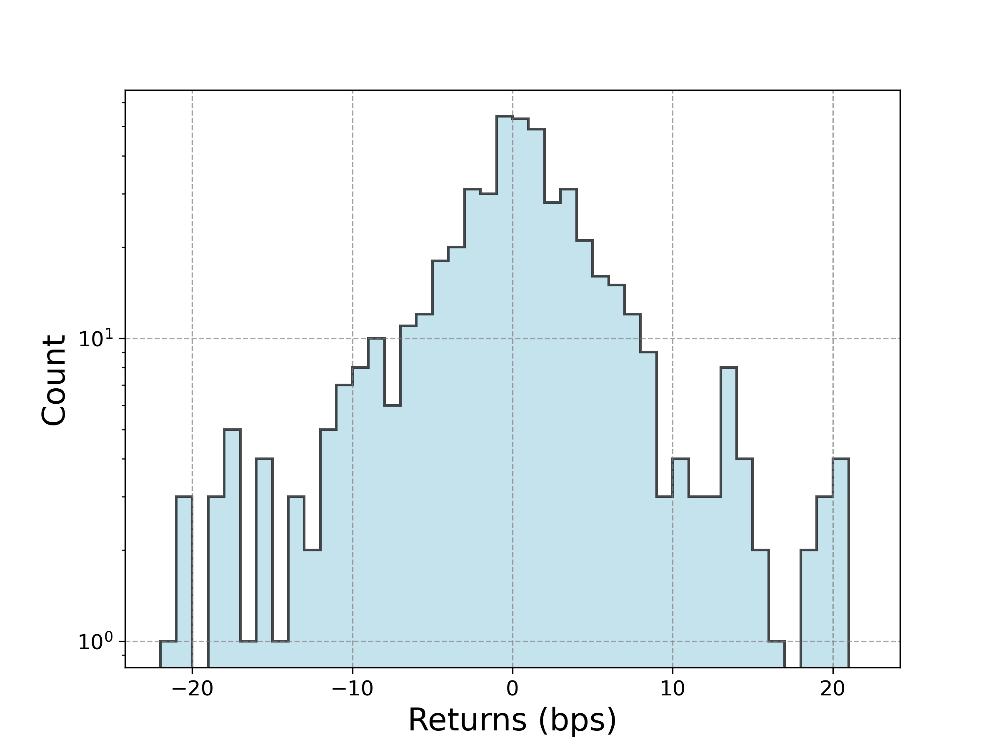

圖 18：模型式做市策略 round-trip 交易在費前報酬的直方圖。

### 7.4 特徵重要性

前一小節顯示反轉模型具有經濟顯著的預測力。本小節解釋其參數：哪些主要經濟因素驅動反轉機率？一個方便起點是分析 logistic regression 係數。為簡化分析，我們聚焦 buy maker 訂單；此時反轉指價格負向不平衡（通常先前有價格下跌）後接續價格上升。若要描述 sell 訂單視角，只需將下文與圖中的 bid/buy 替換為 ask/sell。

**係數分析。** 圖 19 顯示四組特徵中的 logistic regression 係數，只展示絕對值大於 0.05 者以保持視覺簡潔；完整係數見附錄。所有變數在估計前標準化，因此係數可跨特徵比較。以下解讀涉及一定推測，因為需要拆解許多相關因素的影響。

首先考慮動能特徵。`ret_autocov_5s_w*` 具有大型負係數，表示當最近三個 5 秒視窗（合計 15 秒）中，最後成交價是震盪而非持續沿同一方向趨勢時，反轉更可能發生。`ret_sum_100ms_w0` 係數顯著為正，表示最近 100ms 內急劇價格下跌意味著反轉機率更高。綜合來看，平衡的上下價格動作後出現突然價格下跌，與較高反轉機率相關。這具經濟直覺：價格下跌後新 top bid 可能立即缺乏流動性，且缺乏持續下行壓力暗示造成突然下跌的交易較可能是孤立事件，而非一系列持續壓低價格訂單的一部分。

`avg_time_tr_30s_w0` 與 `avg_time_tr_30s_w1` 係數明顯為負，表示過去一分鐘平均交易間隔較長，與反轉機率顯著降低相關。這符合反轉較常發生於市場活動升高期間的直覺，因為此時訂單簿佇列波動頻率更高，top-of-book 存活時間低於安靜時段。`totb_mean` 的大負係數支持此點；`stdev_500` 略為正，也表示更高波動度稍微提高反轉機率。

模型懲罰 bid 側既有大型流動性，`ob_bid_liq` 負係數顯示此點。這合理，因為 touch 上高流動性降低成交機率，而成交是反轉定義的要求之一。相反地，`ob_bid_half` 若小表示 touch 附近流動性高，若大表示從 top bid 往下多層都不流動；其係數略負，表示若 bid 側多層都缺乏流動性，模型預測反轉機率略低。合併兩點，模型偏好 top bid 流動性低、但更深且靠近 top bid 的訂單簿層有大量流動性的情境。這具經濟直覺：若其他 maker 願意只在略深於 top bid 的位置提供大量流動性，則在 top bid 掛單可能不算糟，因為該價格只比更深層略差。

交易量型態中，模型對 `sell_count_5s_w*` 給予中度正係數，代表過去 15 秒成交 sell maker orders 數量較高。相反地，`sell_count_30s_w0` 顯著負係數表示稍遠過去賣出活動盛行時，反轉機率降低。此模式暗示最近賣壓出現，但在其前一段時間主要是買方活動。

`total_sell_5s_w*` 的負係數顯示，若上述高 sell trade count 在相同視窗中合計只消耗少量體積，反轉機率更高，表示它們主要吃掉小型 maker 訂單。這似乎暗示大型 taker volume 可能預示進一步價格下跌。

`buy_count_5s_w0` 正係數（前兩個視窗略負）表示近期買方活動略微提高反轉機率，暗示從賣出轉向買入，可能預告反轉，儘管仍存在價格負向不平衡。

綜合上述觀察，模型理想的反轉條件似乎如下：

1. **波動度升高。** 市場應呈現與高波動相關特徵：高交易到達強度與短 top-of-book 存活時間。在這些條件中，反轉更頻繁，且訂單提交至執行或取消之間時間較短，較不易在訂單生命週期中發生經濟條件變化。
2. **價格移動型態。** 最近 15 秒的最後成交報酬不應有強自相關趨勢，表示價格震盪而非強烈單向趨勢。接著 top bid 價格在最近 100ms 內突然跌至新的局部低點，且既有流動性很少。
3. **交易量動態。** 過去 15 秒有大量 sell trades，且之前一段時間賣出活動少；但這些 sell trades 不應累積太多總量，也就是主要與小型 maker 訂單成交。同時，同期間應有顯著價格下跌，並在過去 5 秒出現買方交易，前一段時間則少有或沒有買方活動。

價格跌至新的局部低點且既有流動性少，暗示訂單有高成交機率；其餘條件則可視為降低進一步價格下跌風險，儘管存在價格負向不平衡，進而降低成交後短期負價格漂移可能性。

**Permutation importance。** 為補充 logistic regression 係數分析，我們對 random forest 進行 permutation importance 分析。此方法透過隨機打亂各特徵值並觀察模型表現影響，評估特徵重要性；準確率大幅下降代表該特徵重要。

最重要六個特徵（分數以最大重要性標準化）為：`ret_autocorr_sum_30s_w0` (1.00)、`velocity_tr_30s_w0` (0.93)、`ob_bid_liq` (0.67)、`totb_mean` (0.57)、`sell_count_30s_w0` (0.27)、`amplitude_100ms_w0` (0.12)。六個特徵後重要性陡降，表示其餘特徵作用較小。此分析與 logistic regression 係數解讀一致：

- `ret_autocov_sum_30s_w0` 的高分強調近期價格自共變異數的重要性，支持負自共變異（價格上下震盪）是反轉重要前兆。
- `velocity_tr_30s_w0` 高分呼應 logistic regression 發現：連續交易間時間短與較高反轉機率強烈正相關。
- `ob_bid_liq` 高分支持前述結論：bid 側大量既有流動性顯著降低反轉機率，因為它降低成交機率，而反轉定義要求成交。
- `totb_mean` 在兩種分析中都突出，強化 top-of-book 價格低存活時間有利於反轉的觀點。
- `sell_count_30s_w0` 在 logistic regression 中有大負係數，其預測反轉的重要性也由 random forest 高 permutation importance 支持。
- `amplitude_100ms_w0` 的中高重要性與 logistic regression 顯著正係數一致，反映反轉較可能發生於非常近期價格下跌後。

總結而言，random forest 中 permutation score 高的解釋變數，也都在 logistic regression 中具有絕對值大的係數；反之，也沒有係數很大卻不具高 permutation importance 的特徵。因此，雖然 permutation importance 不能像係數分析一樣描繪細節，因為它只告訴特徵重要性而不說明如何影響預測，其結果仍與前述發現一致。

（a）交易量型態

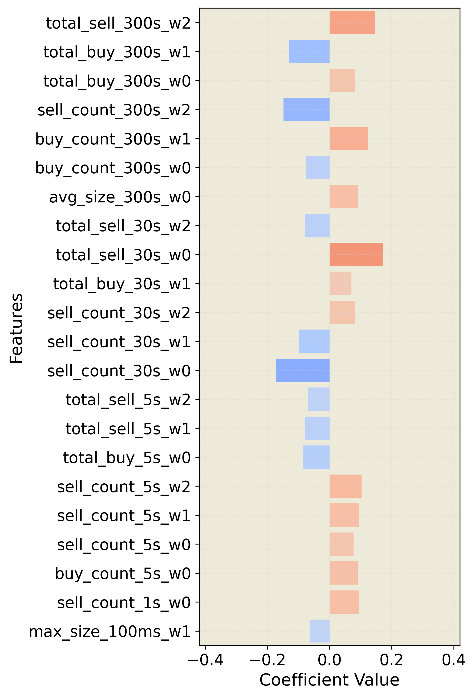

（b）動能特徵

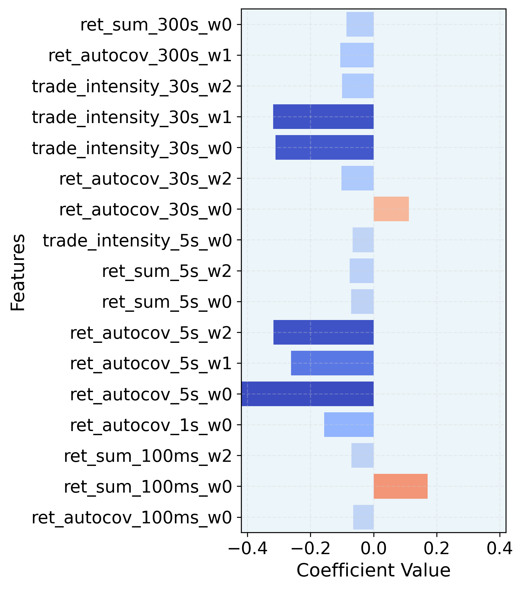

（c）訂單簿特徵

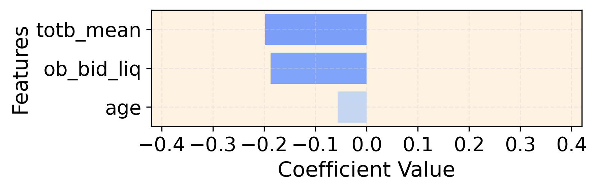

（d）價格動態

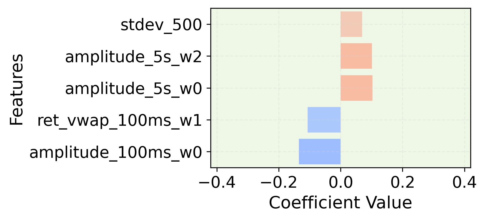

圖 19：依特徵類別分組的 logistic regression 模型係數，展示各特徵對反轉可能性的相對重要性與影響方向；僅顯示絕對值大於 0.05 的係數。

## 8. 結論

透過細緻實證分析，本文描述了 (i) 基本訂單簿機制與 (ii) 價格變動從立即到短時間尺度的強持續性之影響，揭示報酬、佇列大小與訂單佇列位置間的互動。這些互動導致訂單成交機率與成交後報酬呈負相關，對 touch 上可獲利 maker 交易構成根本挑戰。其在高頻交易中的實務後果巨大，使若干自然且常被引用的交易策略在實務上高度不獲利。

為克服這些挑戰，成功做市的關鍵是避免被逆向選擇。原則上，這可透過「防禦性」方法達成，也就是在逆向選擇變得可能時取消訂單（本身就是複雜任務）；本文則探索更主動的策略：開發相對於訂單簿不平衡的反向訊號。這類訊號允許在表面上不利的不平衡期間提交訂單，以便當條件轉為有利時取得早期佇列位置。為顯示此事可行，我們建立這樣的訊號並展示其有效性：它顯著優於 benchmark，並指出哪些特徵可能有助於預測訂單簿不平衡何時錯誤預測下一次價格變化。

該策略在最小單位訂單與低費率假設下略有獲利，雖然這些利潤可能不可擴展；但我們希望此方法能為實務者指出建構交易策略時值得聚焦的方向。本文呈現的具體模型只是許多可能構造之一，意在展示 proof-of-concept，而非優化完成、可投入生產的策略。

模型需使用複雜特徵集合才能取得即便只是 modest 且可能不可擴展的利潤，這支持了本文較早非正式提出的「不可獲利原理」：預測能力與利用容易度反相關。此原理有助於解釋為何許多學術研究難以產生實務上可行的結果，其中一個例子是只關注成交機率；若忽略成交機率與報酬的負相關，可能只是優化出代價高昂的勝利。這種 flawed approach 是兩個更廣泛挑戰的症狀：(i) 未以足夠細緻層次檢視問題，因而無法揭示訂單簿機制對結果的影響；(ii) 缺乏能提供完整圖像的資料，因為即使 L3 資料也只顯示發生了什麼，而不顯示未發生什麼（例如失敗的取消），後者可能同樣重要。透過實盤交易實驗，我們處理了這兩項挑戰，使用其他方法難以取得洞見的研究方法。

最終，如同所有具流動性的 LOB 市場，本文使用的加密交易所高度競爭。HFT（maker 或 taker）獲利的普遍障礙，一部分來自 LOB 市場機制，一部分來自交易者之間的競爭，也普遍來自交易所費用對財富的持續抽取。

## Funding

AYS 感謝 NSERC Discovery Grant RGPIN-2024-05996 的支持。

## Data Availability

支持本研究發現的資料由作者收集，未公開提供。

## Declaration of Competing Interests

作者聲明，與本文描述工作相關，沒有競爭性財務或個人利益。

## 附錄 A：中型佇列直方圖

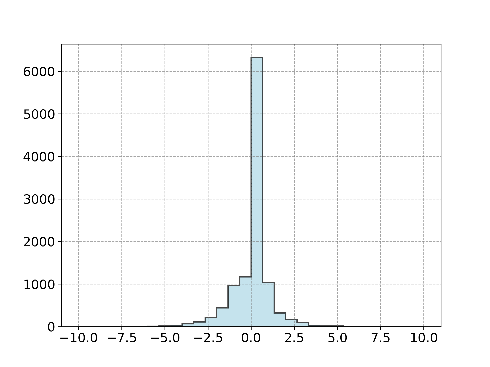

圖 20：佇列位置 0%-10%；近側佇列中等；對側佇列小。

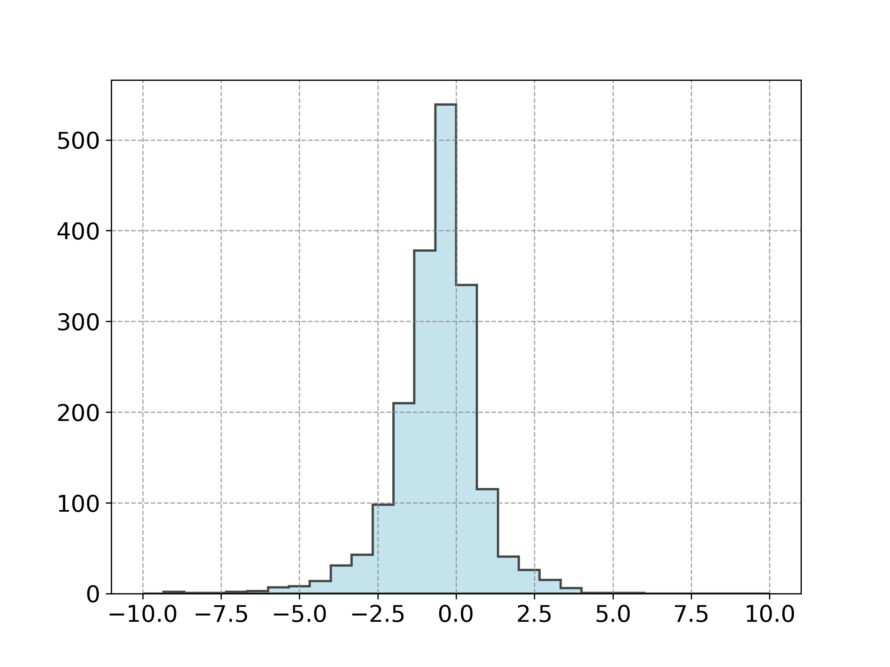

圖 21：佇列位置 75%-100%；近側佇列中等；對側佇列小。

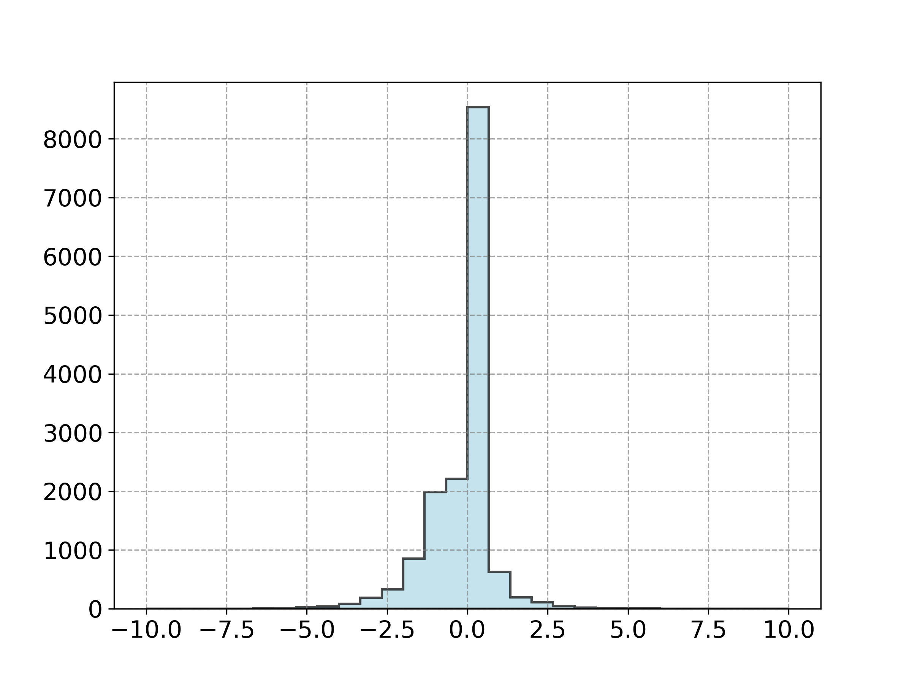

圖 22：佇列位置 0%-10%；近側佇列中等；對側佇列中等。

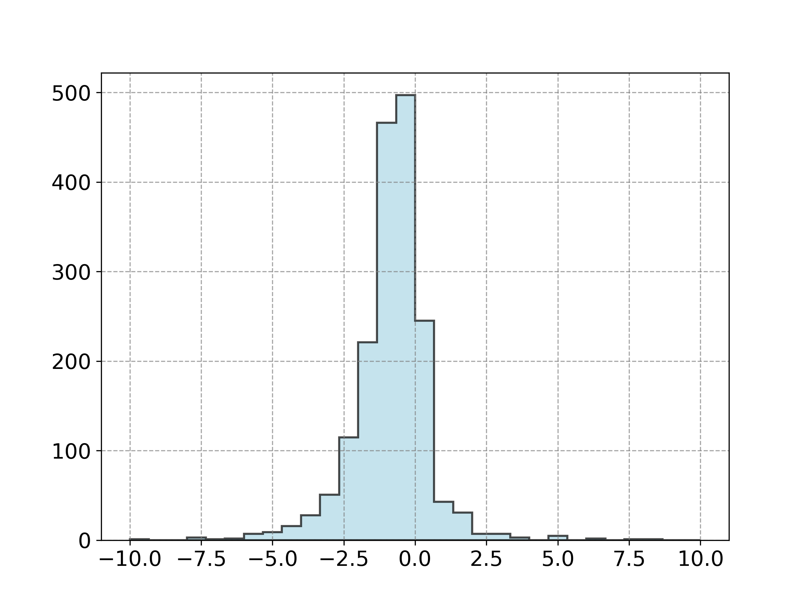

圖 23：佇列位置 75%-100%；近側佇列中等；對側佇列中等。

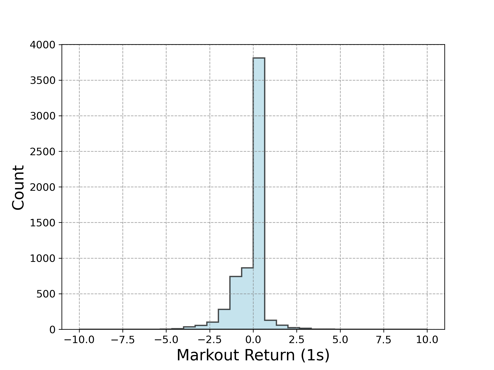

圖 24：佇列位置 0%-10%；近側佇列中等；對側佇列大。

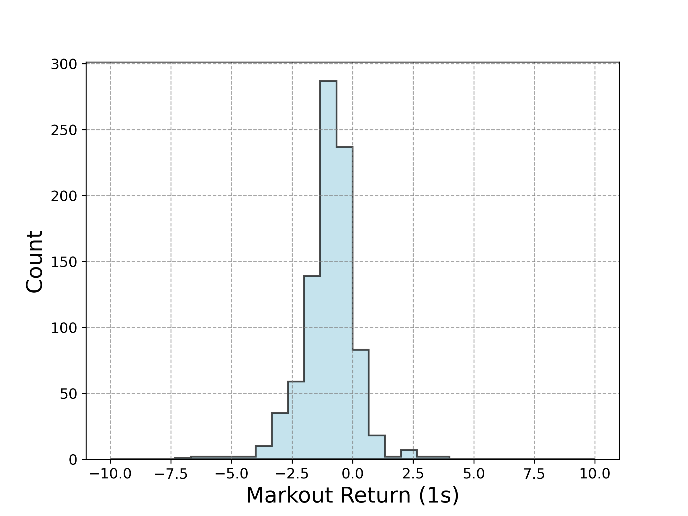

圖 25：佇列位置 75%-100%；近側佇列中等；對側佇列大。

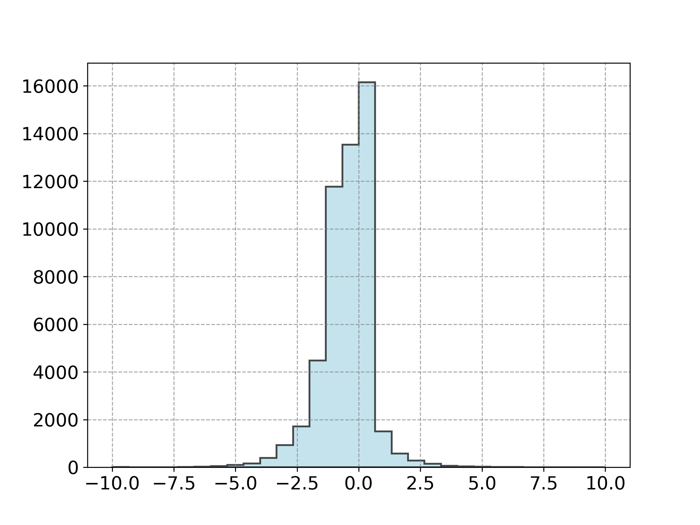

圖 26：佇列位置 0%-10%；近側佇列小；對側佇列中等。

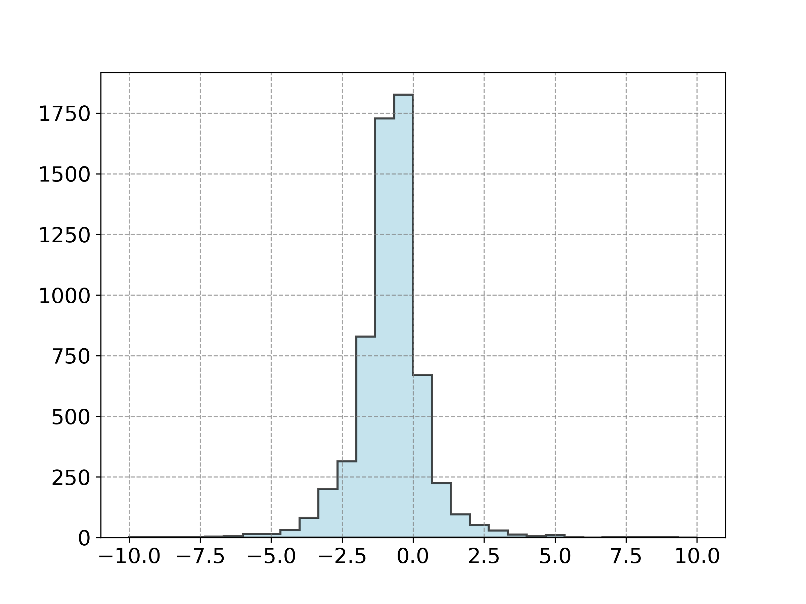

圖 27：佇列位置 75%-100%；近側佇列小；對側佇列中等。

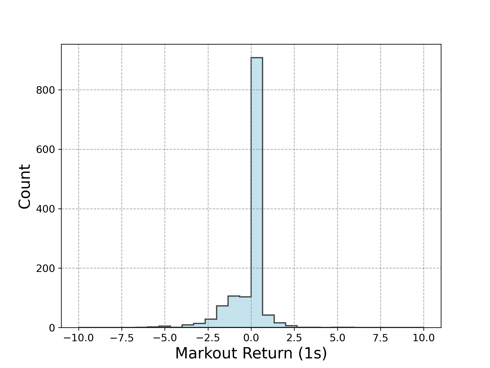

圖 28：佇列位置 0%-10%；近側佇列大；對側佇列中等。

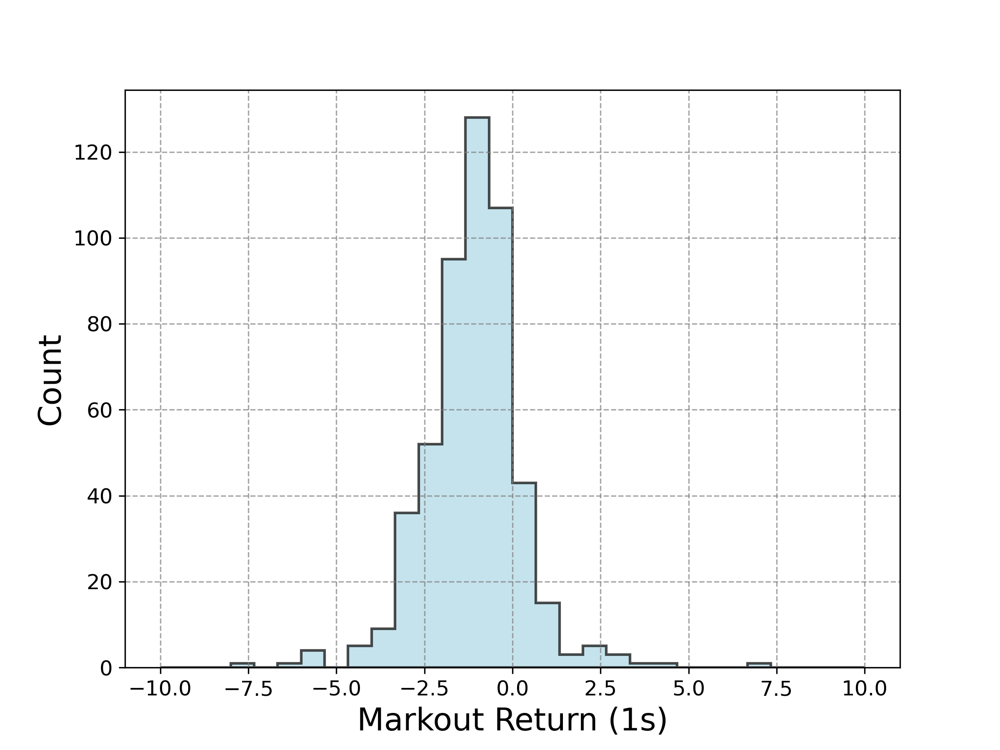

圖 29：佇列位置 75%-100%；近側佇列大；對側佇列中等。

## 附錄 B：模型係數

原文附錄列出 logistic regression 模型依特徵類別分組的完整係數。以下保留原始 feature names，並翻譯表頭與分組名稱。

### 動能

| 特徵 | 係數值 |
|---|---:|
| `ret_autocov_100ms_w0` | -0.064670 |
| `ret_autocov_100ms_w1` | -0.025752 |
| `ret_autocov_100ms_w2` | -0.057328 |
| `ret_sum_100ms_w0` | 0.171598 |
| `ret_sum_100ms_w1` | 0.017349 |
| `ret_sum_100ms_w2` | -0.070002 |
| `trade_intensity_100ms_w0` | -0.028381 |
| `trade_intensity_100ms_w1` | -0.048367 |
| `trade_intensity_100ms_w2` | 0.025111 |
| `ret_autocov_1s_w0` | -0.156862 |
| `ret_autocov_1s_w1` | 0.002328 |
| `ret_autocov_1s_w2` | -0.009059 |
| `ret_sum_1s_w0` | -0.012417 |
| `ret_sum_1s_w1` | 0.006796 |
| `ret_sum_1s_w2` | 0.014250 |
| `trade_intensity_1s_w0` | -0.027251 |
| `trade_intensity_1s_w1` | -0.048310 |
| `trade_intensity_1s_w2` | -0.039917 |
| `ret_autocov_5s_w0` | -0.433133 |
| `ret_autocov_5s_w1` | -0.261970 |
| `ret_autocov_5s_w2` | -0.317830 |
| `ret_sum_5s_w0` | -0.070847 |
| `ret_sum_5s_w1` | 0.016905 |
| `ret_sum_5s_w2` | -0.076009 |
| `trade_intensity_5s_w0` | -0.066931 |
| `trade_intensity_5s_w1` | -0.044181 |
| `trade_intensity_5s_w2` | -0.056927 |
| `ret_autocov_30s_w0` | 0.111506 |
| `ret_autocov_30s_w1` | -0.044950 |
| `ret_autocov_30s_w2` | -0.102125 |
| `ret_sum_30s_w0` | -0.020848 |
| `ret_sum_30s_w1` | 0.033951 |
| `ret_sum_30s_w2` | -0.038579 |
| `trade_intensity_30s_w0` | -0.310782 |
| `trade_intensity_30s_w1` | -0.318268 |
| `trade_intensity_30s_w2` | -0.100313 |
| `ret_autocov_300s_w0` | 0.055847 |
| `ret_autocov_300s_w1` | -0.105477 |
| `ret_autocov_300s_w2` | -0.015074 |
| `ret_sum_300s_w0` | -0.085791 |
| `ret_sum_300s_w1` | 0.048547 |
| `ret_sum_300s_w2` | 0.010486 |
| `trade_intensity_300s_w0` | -0.013885 |
| `trade_intensity_300s_w1` | -0.012627 |
| `trade_intensity_300s_w2` | -0.012789 |

### 訂單簿

| 特徵 | 係數值 |
|---|---:|
| `age` | -0.056527 |
| `ob_ask_liq` | 0.001471 |
| `ob_bid_liq` | -0.187389 |
| `ob_half` | -0.049546 |
| `ob_other_half` | -0.007837 |
| `totb_mean` | -0.198196 |

### 價格動態

| 特徵 | 係數值 |
|---|---:|
| `amplitude_100ms_w0` | -0.134841 |
| `amplitude_100ms_w1` | -0.002490 |
| `amplitude_100ms_w2` | -0.015208 |
| `ret_vwap_100ms_w0` | 0.054331 |
| `ret_vwap_100ms_w1` | -0.106379 |
| `ret_vwap_100ms_w2` | 0.035287 |
| `amplitude_1s_w0` | 0.009782 |
| `amplitude_1s_w1` | 0.007194 |
| `amplitude_1s_w2` | 0.019774 |
| `ret_vwap_1s_w0` | -0.007336 |
| `ret_vwap_1s_w1` | -0.019845 |
| `ret_vwap_1s_w2` | 0.020953 |
| `amplitude_5s_w0` | 0.103106 |
| `amplitude_5s_w1` | 0.051163 |
| `amplitude_5s_w2` | 0.101474 |
| `ret_vwap_5s_w0` | 0.041889 |
| `ret_vwap_5s_w1` | 0.010773 |
| `ret_vwap_5s_w2` | -0.009981 |
| `amplitude_30s_w0` | -0.025883 |
| `amplitude_30s_w1` | 0.009798 |
| `amplitude_30s_w2` | 0.049859 |
| `ret_vwap_30s_w0` | -0.051273 |
| `ret_vwap_30s_w1` | -0.058798 |
| `ret_vwap_30s_w2` | 0.019591 |
| `amplitude_300s_w0` | 0.041433 |
| `amplitude_300s_w1` | 0.023701 |
| `amplitude_300s_w2` | -0.009184 |
| `ret_vwap_300s_w0` | 0.033777 |
| `ret_vwap_300s_w1` | -0.010073 |
| `ret_vwap_300s_w2` | 0.017873 |
| `stdev_100` | -0.014769 |
| `stdev_500` | 0.069001 |

### 交易量型態

| 特徵 | 係數值 |
|---|---:|
| `max_size_100ms_w0` | -0.015398 |
| `max_size_100ms_w1` | -0.064591 |
| `max_size_100ms_w2` | 0.001329 |
| `avg_size_100ms_w0` | -0.012507 |
| `avg_size_100ms_w1` | 0.031008 |
| `avg_size_100ms_w2` | 0.004749 |
| `buy_count_100ms_w0` | -0.002806 |
| `buy_count_100ms_w1` | -0.028945 |
| `buy_count_100ms_w2` | 0.044143 |
| `sell_count_100ms_w0` | -0.042881 |
| `sell_count_100ms_w1` | -0.031871 |
| `sell_count_100ms_w2` | -0.010898 |
| `total_buy_100ms_w0` | 0.017631 |
| `total_buy_100ms_w1` | 0.031328 |
| `total_buy_100ms_w2` | -0.025174 |
| `total_sell_100ms_w0` | 0.027392 |
| `total_sell_100ms_w1` | 0.037905 |
| `total_sell_100ms_w2` | 0.019188 |
| `max_size_1s_w0` | 0.009413 |
| `max_size_1s_w1` | -0.024575 |
| `max_size_1s_w2` | -0.006610 |
| `avg_size_1s_w0` | 0.021593 |
| `avg_size_1s_w1` | 0.015751 |
| `avg_size_1s_w2` | 0.006351 |
| `buy_count_1s_w0` | -0.034406 |
| `buy_count_1s_w1` | -0.046010 |
| `buy_count_1s_w2` | -0.023821 |
| `sell_count_1s_w0` | 0.094811 |
| `sell_count_1s_w1` | 0.024451 |
| `sell_count_1s_w2` | -0.000842 |
| `total_buy_1s_w0` | 0.002977 |
| `total_buy_1s_w1` | -0.003422 |
| `total_buy_1s_w2` | 0.004587 |
| `total_sell_1s_w0` | -0.049719 |
| `total_sell_1s_w1` | -0.012063 |
| `total_sell_1s_w2` | -0.011760 |
| `max_size_5s_w0` | 0.005391 |
| `max_size_5s_w1` | 0.023364 |
| `max_size_5s_w2` | 0.000746 |
| `avg_size_5s_w0` | 0.000672 |
| `avg_size_5s_w1` | -0.002132 |
| `avg_size_5s_w2` | 0.019611 |
| `buy_count_5s_w0` | 0.091383 |
| `buy_count_5s_w1` | -0.026798 |
| `buy_count_5s_w2` | -0.019723 |
| `sell_count_5s_w0` | 0.077718 |
| `sell_count_5s_w1` | 0.094188 |
| `sell_count_5s_w2` | 0.103399 |
| `total_buy_5s_w0` | -0.085354 |
| `total_buy_5s_w1` | -0.041604 |
| `total_buy_5s_w2` | 0.016422 |
| `total_sell_5s_w0` | 0.023385 |
| `total_sell_5s_w1` | -0.077652 |
| `total_sell_5s_w2` | -0.068970 |
| `max_size_30s_w0` | -0.053188 |
| `max_size_30s_w1` | -0.004395 |
| `max_size_30s_w2` | -0.009718 |
| `avg_size_30s_w0` | 0.002545 |
| `avg_size_30s_w1` | -0.010833 |
| `avg_size_30s_w2` | -0.033334 |
| `buy_count_30s_w0` | 0.021358 |
| `buy_count_30s_w1` | -0.046941 |
| `buy_count_30s_w2` | -0.019813 |
| `sell_count_30s_w0` | -0.172218 |
| `sell_count_30s_w1` | -0.098570 |
| `sell_count_30s_w2` | 0.081075 |
| `total_buy_30s_w0` | 0.023254 |
| `total_buy_30s_w1` | 0.070232 |
| `total_buy_30s_w2` | 0.021899 |
| `total_sell_30s_w0` | 0.170826 |
| `total_sell_30s_w1` | 0.001023 |
| `total_sell_30s_w2` | -0.080049 |
| `max_size_300s_w0` | -0.004522 |
| `max_size_300s_w1` | -0.024765 |
| `max_size_300s_w2` | -0.026390 |
| `avg_size_300s_w0` | 0.092860 |
| `avg_size_300s_w1` | -0.006021 |
| `avg_size_300s_w2` | -0.019310 |
| `buy_count_300s_w0` | -0.077479 |
| `buy_count_300s_w1` | 0.124425 |
| `buy_count_300s_w2` | 0.017996 |
| `sell_count_300s_w0` | 0.021356 |
| `sell_count_300s_w1` | -0.036636 |
| `sell_count_300s_w2` | -0.148054 |
| `total_buy_300s_w0` | 0.081260 |
| `total_buy_300s_w1` | -0.129170 |
| `total_buy_300s_w2` | -0.002067 |
| `total_sell_300s_w0` | 0.047449 |
| `total_sell_300s_w1` | -0.008577 |
| `total_sell_300s_w2` | 0.147168 |
